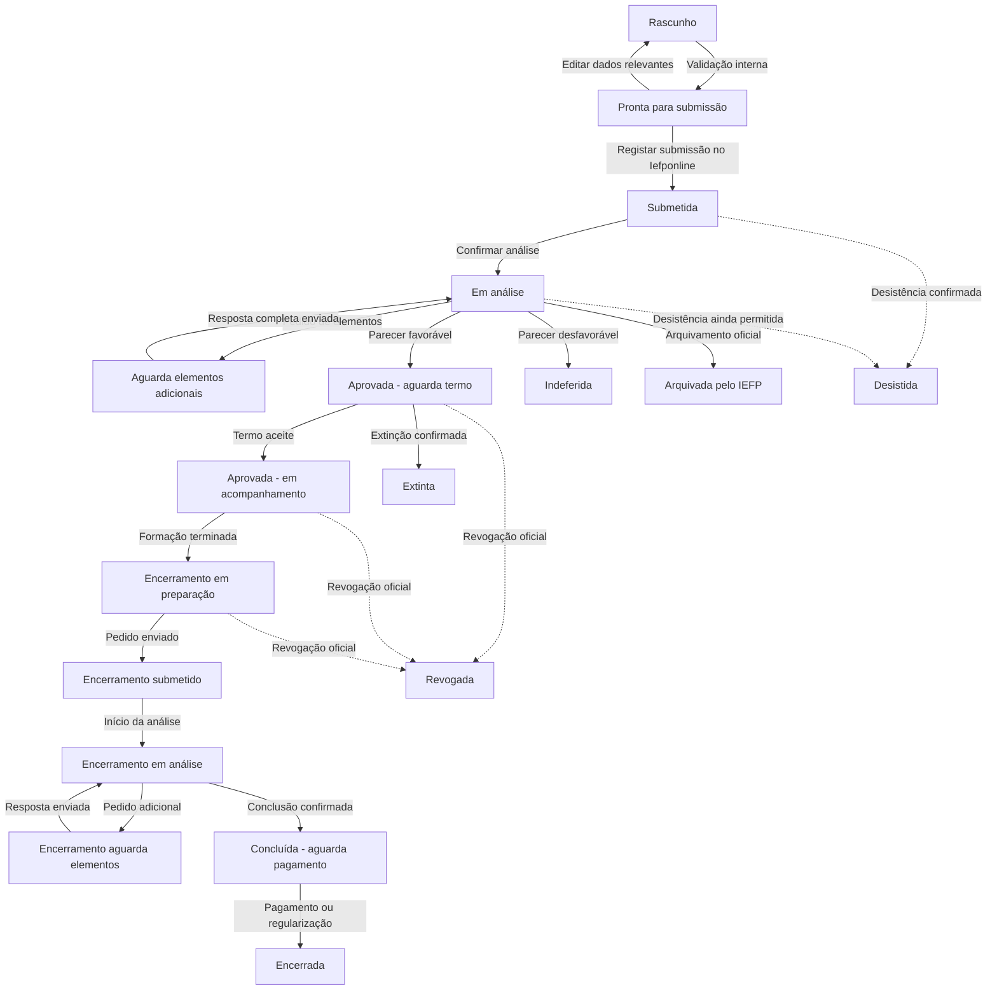

# Tópico 04 - Fluxo e estados da candidatura

## 1. Objetivo

Este documento define o ciclo de vida de uma candidatura no Forma Flow. Estabelece os estados possíveis, as transições autorizadas, os responsáveis, as condições necessárias, os efeitos produzidos e o histórico que deverá ser preservado.

O fluxo parte das três fases representadas no diagrama fornecido:

1. submissão, verificação, análise e decisão;
2. devolução e receção do termo de aceitação;
3. submissão e análise do pedido de encerramento, seguida do fluxo financeiro.

O desenho foi detalhado para incluir rascunhos, pedidos de elementos adicionais, decisões parciais, desistências, incumprimentos, formação, encerramento e pagamentos.

## 2. Princípio fundamental

O Iefponline e o IEFP são a origem oficial dos acontecimentos administrativos. O Forma Flow acompanha esses acontecimentos e controla o trabalho interno, mas não cria automaticamente decisões oficiais.

Assim:

- o sistema pode validar dados, calcular prazos, criar tarefas e emitir alertas;
- um utilizador autorizado regista a submissão, notificação, decisão ou pagamento ocorrido externamente;
- uma transição oficial exige data, origem e, quando disponível, referência ou documento comprovativo;
- ultrapassar um prazo gera risco e alerta, mas não muda automaticamente a candidatura para indeferida, extinta ou revogada;
- correções posteriores ficam no histórico e nunca apagam o acontecimento anterior.

## 3. Decisão de modelação dos estados

O estado principal da candidatura indicará apenas a sua posição no processo administrativo. Outros objetos terão estados próprios.

Esta separação evita estados excessivamente complexos, como “aprovada com formação em curso, documento inválido e pagamento parcial”. Essa situação será representada pela combinação de:

- estado principal da candidatura;
- resultado por beneficiário;
- estado de cada ação de formação;
- estado dos documentos;
- estado dos pedidos de elementos;
- estado do termo de aceitação;
- estado do encerramento;
- estado financeiro.

O dashboard combinará estas dimensões para apresentar o estado, o risco e a próxima ação.

## 4. Fases do processo

| Fase | Início | Fim | Responsabilidade principal |
| --- | --- | --- | --- |
| Preparação | Criação do rascunho | Registo da submissão externa | Candidato ou Gestor/RH |
| Análise | Submissão registada | Decisão oficial registada | IEFP, acompanhado por Gestor/RH |
| Aceitação | Notificação favorável | Termo aceite ou extinção confirmada | Titular e IEFP |
| Acompanhamento | Aceitação confirmada | Formação terminada e encerramento preparado | Candidato, Gestor/RH e entidade formadora |
| Encerramento | Documentos finais reunidos | Conclusão confirmada | Titular e IEFP |
| Financeira | Apoios previstos ou aprovados | Pagamento ou regularização concluídos | IEFP, acompanhado pelo Gestor/RH |
| Terminal excecional | Decisão negativa, desistência ou incumprimento | Sem continuação normal | Interveniente responsável pela decisão |

## 5. Estados principais

Os códigos técnicos serão estáveis e sem acentos. Os nomes apresentados na interface poderão ser traduzidos ou melhorados sem alterar os códigos guardados.

| Código | Nome apresentado | Fase | Terminal | Significado |
| --- | --- | --- | --- | --- |
| `RASCUNHO` | Rascunho | Preparação | Não | Candidatura criada e ainda incompleta ou editável |
| `PRONTA_SUBMISSAO` | Pronta para submissão | Preparação | Não | Validações internas concluídas; aguarda submissão no Iefponline |
| `SUBMETIDA` | Submetida | Análise | Não | Submissão externa registada; aguarda início ou confirmação da análise |
| `EM_ANALISE` | Em análise | Análise | Não | Processo em verificação ou análise pelo IEFP |
| `AGUARDA_ELEMENTOS` | Aguarda elementos adicionais | Análise | Não | Existe pedido do IEFP ainda sem resposta completa |
| `APROVADA_AGUARDA_TERMO` | Aprovada - aguarda termo | Aceitação | Não | Decisão favorável registada; termo de aceitação pendente |
| `APROVADA_ACOMPANHAMENTO` | Aprovada - em acompanhamento | Acompanhamento | Não | Termo aceite; formação e obrigações posteriores em acompanhamento |
| `ENCERRAMENTO_PREPARACAO` | Encerramento em preparação | Encerramento | Não | Formação terminada; documentos finais ainda em preparação |
| `ENCERRAMENTO_SUBMETIDO` | Encerramento submetido | Encerramento | Não | Pedido de encerramento enviado externamente |
| `ENCERRAMENTO_ANALISE` | Encerramento em análise | Encerramento | Não | IEFP está a analisar o pedido de encerramento |
| `ENCERRAMENTO_AGUARDA_ELEMENTOS` | Encerramento aguarda elementos | Encerramento | Não | Existem esclarecimentos ou documentos finais adicionais pendentes |
| `CONCLUIDA_AGUARDA_PAGAMENTO` | Concluída - aguarda pagamento | Financeira | Não | Conclusão confirmada; falta concluir o fluxo financeiro |
| `ENCERRADA` | Encerrada | Final | Sim | Processo e fluxo financeiro concluídos ou regularizados |
| `INDEFERIDA` | Indeferida | Final excecional | Sim | Decisão oficial desfavorável registada |
| `ARQUIVADA` | Arquivada pelo IEFP | Final excecional | Sim | Arquivamento oficial registado, incluindo falta de dotação quando aplicável |
| `DESISTIDA` | Desistida | Final excecional | Sim | Desistência externa confirmada |
| `EXTINTA` | Extinta | Final excecional | Sim | Extinção oficial registada, por exemplo por falta de aceitação |
| `REVOGADA` | Revogada | Final excecional | Sim | Aprovação posteriormente revogada por decisão oficial |
| `RASCUNHO_ARQUIVADO` | Rascunho arquivado | Arquivo local | Sim | Preparação abandonada antes de existir submissão oficial |

Um estado terminal impede alterações normais, mas mantém a consulta, os documentos e o histórico.

## 6. Diagrama do fluxo principal

O diagrama mostra o percurso administrativo principal. Estados de documentos, formação, pedidos e pagamentos são controlados em paralelo e funcionam como condições para as transições.

## 7. Transições do fluxo principal

### 7.1. Preparação e submissão

| Transição | Origem | Destino | Ação ou acontecimento | Condições principais |
| --- | --- | --- | --- | --- |
| `TR-001` | Sem candidatura | `RASCUNHO` | Criar candidatura | Utilizador autenticado, tipo e titular definidos |
| `TR-002` | `RASCUNHO` | `PRONTA_SUBMISSAO` | Validar candidatura | Sem bloqueios; avisos reconhecidos; dados e documentos da fase completos |
| `TR-003` | `PRONTA_SUBMISSAO` | `RASCUNHO` | Editar dados relevantes | Edição autorizada; invalida a validação anterior |
| `TR-004` | `PRONTA_SUBMISSAO` | `SUBMETIDA` | Registar submissão externa | Data de submissão, declarações e utilizador responsável; referência externa quando exista |
| `TR-005` | `RASCUNHO` ou `PRONTA_SUBMISSAO` | `RASCUNHO_ARQUIVADO` | Abandonar preparação | Confirmação; não pode existir submissão externa |

Efeitos de `TR-004`:

- guardar a versão das regras aplicada;
- bloquear alterações estruturais comuns;
- criar o prazo previsto de decisão;
- guardar uma fotografia dos beneficiários, formações, custos e documentos submetidos;
- criar o primeiro evento oficial no histórico.

### 7.2. Análise e decisão

| Transição | Origem | Destino | Ação ou acontecimento | Condições principais |
| --- | --- | --- | --- | --- |
| `TR-006` | `SUBMETIDA` | `EM_ANALISE` | Registar início ou confirmação de análise | Acontecimento externo identificado |
| `TR-007` | `EM_ANALISE` | `AGUARDA_ELEMENTOS` | Registar pedido de elementos | Pedido, questões, data e prazo definidos |
| `TR-008` | `AGUARDA_ELEMENTOS` | `EM_ANALISE` | Registar resposta completa | Todas as questões obrigatórias respondidas e anexos exigidos presentes |
| `TR-009` | `EM_ANALISE` | `APROVADA_AGUARDA_TERMO` | Registar decisão favorável | Notificação, data, beneficiários deferidos e valores oficiais registados |
| `TR-010` | `EM_ANALISE` | `INDEFERIDA` | Registar decisão desfavorável | Notificação, data e motivo registados |
| `TR-011` | `EM_ANALISE` | `ARQUIVADA` | Registar arquivamento oficial | Notificação, data e motivo registados |
| `TR-012` | `SUBMETIDA`, `EM_ANALISE` ou `AGUARDA_ELEMENTOS` | `DESISTIDA` | Confirmar desistência externa | Operação ainda permitida externamente, confirmação, data e motivo |

Efeitos de `TR-007`:

- suspender o prazo previsto de decisão;
- criar o prazo de resposta;
- criar tarefas para os destinatários;
- emitir a notificação inicial sem duplicados.

Efeitos de `TR-008`:

- fechar o período de suspensão na data de envio da resposta;
- cancelar lembretes de resposta ainda pendentes;
- recalcular a previsão de decisão;
- manter o pedido e as respostas disponíveis no histórico.

### 7.3. Aceitação e acompanhamento

| Transição | Origem | Destino | Ação ou acontecimento | Condições principais |
| --- | --- | --- | --- | --- |
| `TR-013` | `APROVADA_AGUARDA_TERMO` | `APROVADA_ACOMPANHAMENTO` | Confirmar termo aceite | Termo recebido e validado, data e tipo de assinatura registados |
| `TR-014` | `APROVADA_AGUARDA_TERMO` | `EXTINTA` | Registar extinção oficial | Decisão ou comunicação externa e motivo registados |
| `TR-015` | `APROVADA_ACOMPANHAMENTO` | `ENCERRAMENTO_PREPARACAO` | Iniciar encerramento | Todas as ações deferidas relevantes terminaram ou têm resultado final justificado |

Efeitos de `TR-009`:

- criar o prazo do termo de aceitação;
- criar requisitos documentais do termo;
- guardar valores aprovados separadamente das estimativas;
- definir o resultado de cada beneficiário.

Efeitos de `TR-013`:

- fechar o prazo do termo;
- iniciar o acompanhamento da primeira prestação financeira;
- manter a situação real de cada formação no respetivo estado próprio.

### 7.4. Encerramento e fluxo financeiro

| Transição | Origem | Destino | Ação ou acontecimento | Condições principais |
| --- | --- | --- | --- | --- |
| `TR-016` | `ENCERRAMENTO_PREPARACAO` | `ENCERRAMENTO_SUBMETIDO` | Registar pedido externo | Documentos finais válidos; data e referência de envio; prazo não ignorado sem justificação |
| `TR-017` | `ENCERRAMENTO_SUBMETIDO` | `ENCERRAMENTO_ANALISE` | Registar início da análise | Acontecimento externo identificado |
| `TR-018` | `ENCERRAMENTO_ANALISE` | `ENCERRAMENTO_AGUARDA_ELEMENTOS` | Registar pedido adicional | Questões, documentos e prazo definidos |
| `TR-019` | `ENCERRAMENTO_AGUARDA_ELEMENTOS` | `ENCERRAMENTO_ANALISE` | Registar resposta completa | Respostas e documentos obrigatórios presentes |
| `TR-020` | `ENCERRAMENTO_ANALISE` | `CONCLUIDA_AGUARDA_PAGAMENTO` | Confirmar conclusão | Resultado externo, valores finais e participantes abrangidos registados |
| `TR-021` | `CONCLUIDA_AGUARDA_PAGAMENTO` | `ENCERRADA` | Confirmar pagamento ou regularização | Movimentos previstos resolvidos ou decisão de não pagamento registada |

Efeitos de `TR-015`:

- calcular o limite de dois meses a partir das datas reais de fim;
- criar a checklist final por beneficiário, ação e tipologia de formação;
- alertar para certificados, frequência, declaração da formadora e comprovativos em falta.

Efeitos de `TR-016`:

- guardar uma fotografia dos documentos incluídos no pedido;
- impedir a substituição silenciosa desses documentos;
- concluir as tarefas de preparação e criar a tarefa de acompanhamento da análise.

### 7.5. Incumprimento, revogação e correção

| Transição | Origem | Destino | Ação ou acontecimento | Condições principais |
| --- | --- | --- | --- | --- |
| `TR-022` | Qualquer estado posterior à aprovação e não terminal | `REVOGADA` | Registar revogação oficial | Comunicação, data, motivo e efeitos financeiros registados |
| `TR-023` | Estado terminal | Estado anterior autorizado | Corrigir registo incorreto | Apenas Administrador; justificação; sem apagar a transição incorreta |

`TR-023` é uma correção administrativa excecional e não uma reabertura comum. O histórico deverá mostrar o erro, a correção e o utilizador responsável.

## 8. Responsabilidade pelas transições

| Grupo de ações | Candidato | Gestor/RH | Administrador | Sistema |
| --- | --- | --- | --- | --- |
| Criar e editar candidatura individual própria | Sim | Quando atribuído | Sim | Não |
| Criar e editar candidatura empresarial | Não | Empresa associada | Sim | Não |
| Validar para preparação | Própria | No seu âmbito | Sim | Executa as regras |
| Registar submissão individual | Própria | Quando atribuído | Sim | Calcula efeitos |
| Registar submissão empresarial | Não | Empresa associada | Sim | Calcula efeitos |
| Registar pedido ou decisão do IEFP | Não | No seu âmbito | Sim | Nunca decide |
| Preparar resposta ou documentos próprios | Sim | No seu âmbito | Sim | Valida completude |
| Confirmar validação administrativa | Não | No seu âmbito | Sim | Nunca confirma externamente |
| Registar termo próprio entregue | Sim | No seu âmbito | Sim | Gera prazos e tarefas |
| Confirmar termo aceite pelo IEFP | Não | No seu âmbito | Sim | Não |
| Pedir desistência | Própria | No seu âmbito | Sim | Não |
| Confirmar desistência, extinção ou revogação | Não | No seu âmbito | Sim | Nunca automaticamente |
| Corrigir uma transição terminal | Não | Não | Sim | Não |

As permissões do Tópico 2 continuam a limitar o âmbito da empresa e do candidato, mesmo quando o perfil aparece como autorizado nesta tabela.

## 9. Estados paralelos

### 9.1. Resultado por beneficiário

Uma candidatura empresarial pode ter decisão parcial. Por isso, cada participação terá um resultado próprio:

- `PENDENTE`;
- `DEFERIDA`;
- `INDEFERIDA`;
- `ARQUIVADA`;
- `DESISTIDA`;
- `REVOGADA`;
- `ENCERRADA`.

Regras de agregação:

- se pelo menos um beneficiário for deferido, a candidatura segue o ramo de aprovação;
- se existirem beneficiários deferidos e não deferidos, o resultado global será `DEFERIDA_PARCIAL`;
- se todos forem indeferidos, a candidatura fica `INDEFERIDA`;
- participantes não deferidos deixam de gerar tarefas de formação, termo e encerramento;
- o processo global só conclui quando todos os participantes deferidos tiverem um resultado final.

O campo separado `resultado_decisao` da candidatura poderá assumir `PENDENTE`, `DEFERIDA_TOTAL`, `DEFERIDA_PARCIAL`, `INDEFERIDA` ou `ARQUIVADA`. Desta forma, uma candidatura pode estar em `APROVADA_AGUARDA_TERMO` e conservar a indicação de que apenas parte dos beneficiários foi deferida.

### 9.2. Ação de formação

Cada ação associada a um beneficiário poderá estar:

- `PLANEADA`;
- `EM_CURSO`;
- `CONCLUIDA_COM_APROVEITAMENTO`;
- `CONCLUIDA_SEM_APROVEITAMENTO`;
- `INTERROMPIDA`;
- `CANCELADA`.

A passagem para `EM_CURSO` e a conclusão dependem de datas reais registadas. Uma ação interrompida ou concluída sem aproveitamento cria uma tarefa de análise de consequências, sem revogar automaticamente a candidatura.

### 9.3. Pedido de elementos

Cada pedido, seja da análise inicial ou do encerramento, poderá estar:

- `ABERTO`;
- `RESPOSTA_RASCUNHO`;
- `RESPONDIDO`;
- `FECHADO`;
- `EXPIRADO`;
- `CANCELADO`.

O estado `EXPIRADO` indica incumprimento do prazo interno calculado, mas não determina sozinho o resultado oficial da candidatura.

### 9.4. Termo de aceitação

- `NAO_APLICAVEL`;
- `PENDENTE`;
- `RECEBIDO`;
- `VALIDADO`;
- `INVALIDO`;
- `FORA_PRAZO`;
- `DISPENSADO_COM_JUSTIFICACAO`.

Um termo fora de prazo poderá ainda ser aceite externamente. A data real e a decisão do IEFP prevalecem sobre o alerta.

### 9.5. Documento

Mantêm-se os estados definidos no Tópico 3:

- `EM_FALTA`;
- `RECEBIDO`;
- `EM_VALIDACAO`;
- `VALIDO`;
- `INVALIDO`;
- `SUBSTITUIDO`;
- `DISPENSADO_COM_JUSTIFICACAO`.

### 9.6. Situação financeira

- `SEM_APOIO`;
- `ESTIMADO`;
- `APROVADO`;
- `PRIMEIRA_PRESTACAO_PENDENTE`;
- `PARCIALMENTE_PAGO`;
- `PAGAMENTO_FINAL_PENDENTE`;
- `PAGO`;
- `RESTITUICAO_PENDENTE`;
- `RESTITUIDO`;
- `REGULARIZADO`.

Os movimentos financeiros serão registados individualmente; o estado será derivado dos movimentos e não alterado livremente.

## 10. Prazos associados a acontecimentos

| Acontecimento | Prazo criado | Unidade | Suspende outro prazo |
| --- | --- | --- | --- |
| Submissão externa | Decisão prevista em até 30 | Dias úteis | Não |
| Pedido de elementos durante análise | Resposta em 10 | Dias úteis | Sim, prazo de decisão |
| Notificação de aprovação | Devolução do termo em 10 | Dias úteis | Não |
| Entrega do último documento para primeira prestação | Processamento em 5 | Dias úteis | Não |
| Fim real da formação | Entrega do encerramento em 2 | Meses de calendário | Não |
| Confirmação dos documentos finais | Processamento do remanescente em 10 | Dias úteis | Não |
| Notificação de restituição | Restituição em 60 | Dias consecutivos | Não |

Os valores são os parâmetros de referência definidos no Tópico 3. Cada prazo guardará a regra e versão utilizadas.

## 11. Regras de suspensão e retoma

- Um pedido de elementos cria um período de suspensão com data de início.
- A resposta completa fecha esse período e define a data de retoma interna.
- Vários pedidos criam vários períodos independentes.
- Dois períodos não podem sobrepor-se sem correção justificada.
- Se a data oficial diferir da data calculada, um utilizador autorizado poderá corrigi-la sem apagar o cálculo original.
- Fechar, cancelar ou reabrir um pedido recalculará apenas os prazos futuros.
- Prazos já cumpridos ou notificações já emitidas permanecerão no histórico.

## 12. Alertas não são estados

Os seguintes indicadores serão calculados e mostrados no dashboard, mas não alterarão o estado principal:

- **em risco**, quando um prazo ou requisito se aproxima do limite;
- **em atraso**, quando o prazo calculado foi ultrapassado;
- **bloqueada internamente**, quando falta uma condição para a próxima ação;
- **com documentos em falta**;
- **com inconsistências**;
- **sem atualização externa**, quando não existe informação recente;
- **ação urgente**, quando existe tarefa vencida ou muito próxima do limite.

Separar estado e indicador permite, por exemplo, que uma candidatura continue `EM_ANALISE` enquanto aparece simultaneamente “em atraso” e “aguarda confirmação externa”.

## 13. Validação de cada transição

Toda a mudança deverá seguir esta ordem:

1. carregar a candidatura dentro do âmbito permitido ao utilizador;
2. confirmar que a versão apresentada ainda corresponde à versão guardada;
3. verificar se o estado atual aceita a transição pedida;
4. verificar o perfil e as permissões sobre o objeto;
5. executar as regras de bloqueio e recolher os avisos;
6. exigir campos, documento, motivo ou confirmação aplicáveis;
7. alterar o estado e criar efeitos relacionados numa única transação;
8. escrever o histórico e a auditoria;
9. criar, concluir ou cancelar tarefas e notificações;
10. apresentar ao utilizador o novo estado e a próxima ação.

Se algum passo falhar, nenhuma alteração parcial deverá ficar guardada.

## 14. Concorrência e repetição de pedidos

- Cada candidatura terá um número interno de versão atualizado em todas as alterações relevantes.
- Se dois utilizadores tentarem mudar o mesmo estado, a segunda operação deverá ser recusada e pedir atualização da página.
- Repetir o mesmo pedido por falha de rede não poderá criar duas transições, dois prazos ou duas notificações iguais.
- Referências externas repetidas deverão originar aviso de possível duplicação.
- Operações que carregam ficheiros deverão limpar ficheiros órfãos quando a transação de dados falhar.

## 15. Histórico de estados

Cada transição guardará:

- candidatura e beneficiário, quando aplicável;
- estado anterior e estado seguinte;
- ação ou acontecimento que causou a mudança;
- data efetiva do acontecimento;
- data e hora do registo no Forma Flow;
- utilizador responsável;
- origem interna ou externa;
- referência e documento comprovativo, quando existam;
- motivo, observação e justificação de exceção;
- versão das regras usada;
- número de versão da candidatura antes e depois da alteração.

O histórico será imutável nas operações normais. Uma correção criará um novo evento que referencia o evento corrigido.

## 16. Próxima ação sugerida

O sistema determinará uma próxima ação sem mudar automaticamente decisões oficiais.

Exemplos:

| Estado | Próxima ação sugerida |
| --- | --- |
| `RASCUNHO` | Completar campos e documentos da preparação |
| `PRONTA_SUBMISSAO` | Submeter no Iefponline e registar a referência |
| `SUBMETIDA` | Confirmar receção ou início da análise |
| `EM_ANALISE` | Acompanhar notificações do IEFP |
| `AGUARDA_ELEMENTOS` | Responder às questões e anexar documentos |
| `APROVADA_AGUARDA_TERMO` | Assinar e devolver o termo de aceitação |
| `APROVADA_ACOMPANHAMENTO` | Acompanhar formação, frequência e primeira prestação |
| `ENCERRAMENTO_PREPARACAO` | Reunir comprovativos e certificados finais |
| `ENCERRAMENTO_SUBMETIDO` | Confirmar início da análise do encerramento |
| `ENCERRAMENTO_ANALISE` | Acompanhar decisão e valor remanescente |
| `CONCLUIDA_AGUARDA_PAGAMENTO` | Confirmar pagamento ou regularização |
| Estado terminal | Consultar resultado e histórico |

## 17. Correções e exceções

- Uma exceção nunca permitirá alterar diretamente o campo do estado.
- O utilizador escolherá uma transição excecional explicitamente autorizada.
- Será sempre exigida uma justificação.
- Uma correção de data recalculará prazos futuros, mantendo datas anteriores no histórico.
- Uma decisão oficial corrigida exigirá o novo documento ou referência, quando disponível.
- O Administrador poderá corrigir um estado terminal; o Gestor/RH deverá solicitar essa correção.
- Não existirão botões genéricos “mudar estado” ou listas que permitam escolher qualquer estado.

### 17.1. Acontecimentos registados fora de sequência

Como o acompanhamento é manual, um utilizador poderá conhecer uma decisão antes de ter registado o início da análise. Nestes casos:

- um formulário guiado pedirá os acontecimentos intermédios em falta;
- as transições intermédias serão criadas dentro da mesma operação, pela ordem correta;
- uma data desconhecida permanecerá vazia e será marcada como não confirmada;
- o sistema nunca inventará uma data para completar o fluxo;
- a data efetiva poderá ser anterior à data de registo no Forma Flow;
- alertas que já estariam vencidos serão registados no histórico sem enviar notificações antigas em massa;
- o utilizador não poderá contornar o fluxo através da edição direta do estado final.

Por exemplo, ao registar uma decisão quando a candidatura ainda está `SUBMETIDA`, o sistema cria primeiro o evento de entrada em `EM_ANALISE` e depois a transição correspondente à decisão.

## 18. Critérios de aceitação do Tópico 4

Na implementação futura, o fluxo será considerado correto quando os testes demonstrarem que:

1. uma candidatura nova começa sempre em `RASCUNHO`;
2. só uma candidatura internamente válida chega a `PRONTA_SUBMISSAO`;
3. editar dados relevantes invalida a preparação anterior;
4. a submissão cria prazo, fotografia dos dados e histórico;
5. um pedido de elementos suspende o prazo de decisão;
6. uma resposta incompleta não retoma a análise;
7. nenhuma rotina automática cria aprovação, indeferimento, extinção ou revogação;
8. uma aprovação cria termo, prazo e resultados por beneficiário;
9. uma decisão parcial mantém apenas os beneficiários deferidos no fluxo;
10. o termo em falta gera alertas sem provocar extinção automática;
11. o encerramento não é submetido sem os documentos finais válidos;
12. a candidatura só chega a `ENCERRADA` depois da conclusão financeira;
13. estados terminais recusam alterações normais;
14. transições concorrentes não se sobrepõem;
15. repetir uma operação não duplica eventos ou notificações;
16. uma correção administrativa preserva o evento original;
17. cada estado apresenta uma próxima ação coerente;
18. indicadores de risco e atraso não substituem o estado principal;
19. acontecimentos registados tardiamente criam as transições intermédias sem inventar datas.

## 19. Rastreabilidade das fontes

- O diagrama de fases fornecido define os três grandes momentos, os ramos favorável e desfavorável e a passagem da conclusão ao encerramento através do fluxo financeiro.
- O diagrama de casos de uso confirma as ações de registar, consultar e atualizar candidaturas, validar documentação, consultar prazos, consultar histórico e submeter o encerramento.
- O diagrama de classes confirma a necessidade de candidaturas, histórico, prazos, documentos e notificações como objetos relacionados.
- O regulamento de 2021 fundamenta submissão, análise, elementos adicionais, decisão, termo de aceitação, pagamentos, documentação final e incumprimento.
- O manual do titular de 2023 detalha os procedimentos de resposta, devolução do termo, desistência e pedido de encerramento.
- As regras concretas e valores configuráveis continuam definidos no Tópico 3.

## 20. Resultado e ligação ao próximo tópico

O Forma Flow passa a ter uma máquina de estados explícita, auditável e preparada para candidaturas individuais ou empresariais com decisões parciais. O Tópico 5 deverá transformar estes estados, transições, resultados por beneficiário, prazos, pedidos, documentos, movimentos financeiros e eventos históricos num modelo de dados relacional.
