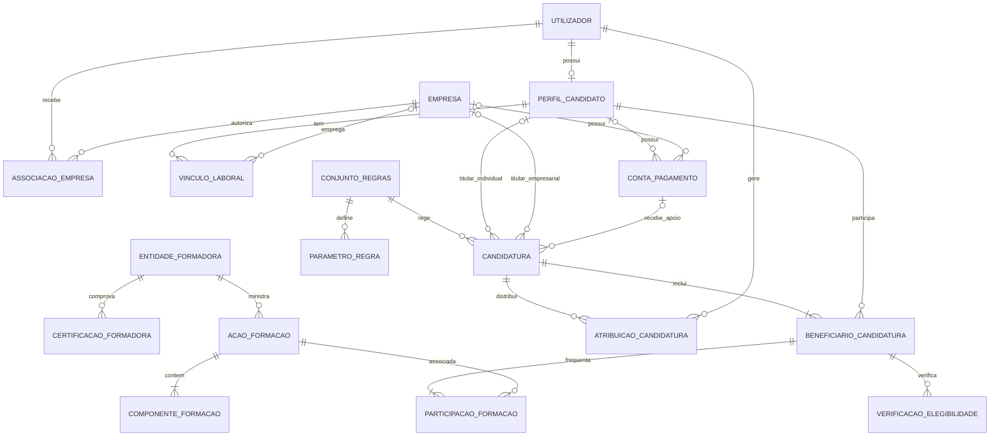
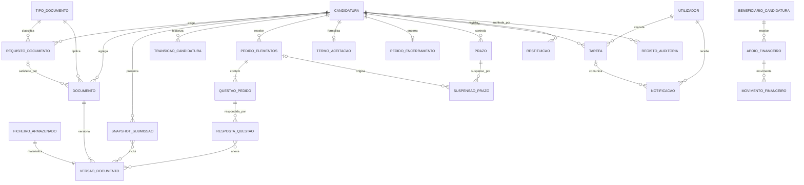

# Tópico 05 - Modelo de dados definitivo

## 1. Objetivo

Este documento define o modelo relacional que servirá de base à implementação do Forma Flow em Django. O modelo suporta candidaturas individuais e empresariais, vários beneficiários e formações, regras configuráveis, documentos versionados, estados, prazos, pedidos, notificações, valores financeiros e auditoria.

O detalhe dos campos de cada entidade encontra-se no [Dicionário de dados do Tópico 5](05-dicionario-de-dados.md).

Ainda não são criados modelos Django nem migrações neste tópico. Os nomes, relações e restrições aqui definidos serão a especificação para essa implementação.

## 2. Evolução do modelo inicial

O trabalho dos módulos anteriores identificava seis tabelas principais:

- `EMPRESA`;
- `UTILIZADOR`;
- `FORMACAO`;
- `CANDIDATURA`;
- `DOCUMENTO`;
- `NOTIFICACAO`.

Essas tabelas continuam representadas, mas foram divididas e complementadas porque o planeamento detalhado revelou novas necessidades:

- um utilizador pode ser gestor de várias empresas e também candidato;
- o vínculo laboral é diferente da permissão de gestão de uma empresa;
- uma candidatura empresarial pode incluir até ao limite configurado de trabalhadores;
- cada trabalhador pode frequentar ações de formação diferentes;
- uma formação pode ter várias componentes CNQ e extra-CNQ;
- documentos obrigatórios dependem do beneficiário, fase e tipo de formação;
- cada substituição de ficheiro deve preservar versões anteriores;
- prazos podem ser suspensos, retomados e corrigidos;
- a decisão pode ser diferente para cada beneficiário;
- estimativas, valores aprovados e pagamentos não são a mesma informação;
- o histórico administrativo e a auditoria técnica têm finalidades diferentes.

O novo modelo mantém a normalização até à terceira forma normal nas entidades operacionais. A duplicação só será usada deliberadamente em fotografias imutáveis de submissão e campos de resumo derivados.

## 3. Princípios de modelação

### 3.1. Relações explícitas

Relações muitos-para-muitos com informação própria terão uma entidade associativa. Por exemplo, a ligação entre beneficiário e ação de formação será representada por `ParticipacaoFormacao`, onde ficam horas, custos, frequência e estado.

### 3.2. Estado atual com histórico

`Candidatura.estado_atual` permitirá consultas rápidas. A fonte histórica será `TransicaoCandidatura`, criada na mesma transação sempre que o estado mudar. O estado atual nunca poderá ser alterado diretamente.

### 3.3. Dados atuais e fotografias históricas

Dados de utilizadores, empresas e regras podem mudar. `SnapshotSubmissao` conservará os dados e as versões de documentos usados numa submissão, termo ou encerramento, sem depender dos valores atuais.

### 3.4. Valores desconhecidos não são zero

Datas, montantes e horas desconhecidos permanecerão nulos. O valor zero será usado apenas quando tiver significado confirmado.

### 3.5. Decisões externas separadas de cálculos

Estimativas automáticas serão guardadas separadamente dos valores aprovados e finais. Estados oficiais exigirão registo de origem, data e utilizador.

### 3.6. Ficheiros separados da informação documental

`FicheiroArmazenado` guardará metadados técnicos. `Documento` e `VersaoDocumento` guardarão o significado, versão, validação e relação com a candidatura. Nenhum caminho físico de ficheiro será tratado como documento de negócio.

### 3.7. Arquivo em vez de eliminação

Entidades com histórico serão desativadas ou arquivadas. Eliminação em cascata ficará limitada a objetos dependentes que ainda não tenham valor histórico.

## 4. Convenções técnicas

- Os nomes conceptuais e das futuras classes Django serão em português, sem acentos nos identificadores de código.
- A interface continuará em português de Portugal.
- Todas as tabelas terão chave primária `id` do tipo inteiro longo gerada automaticamente.
- Candidaturas, documentos e outros objetos expostos em endereços públicos terão também `public_id` UUID único e imutável.
- Datas e horas serão guardadas com fuso horário; a apresentação usará `Europe/Lisbon`.
- Valores monetários usarão decimal com duas casas, nunca ponto flutuante.
- Horas poderão ter duas casas decimais.
- NIF, NIPC, IBAN, telefones e referências externas serão texto, não números.
- Estados e categorias usarão conjuntos fechados de escolhas.
- Campos JSON serão reservados para snapshots, condições versionadas e decomposições de cálculos, não para relações principais pesquisáveis.
- Todas as entidades mutáveis terão `criado_em` e `atualizado_em`.
- Entidades arquiváveis terão `arquivado_em` e `arquivado_por`.
- A base de dados relacional de destino será decidida na estrutura técnica; PostgreSQL é a opção recomendada para suportar restrições e índices com maior consistência.

## 5. Áreas e entidades

O modelo contém 38 entidades conceptuais.

| Área | Entidades |
| --- | --- |
| Identidade e organizações | `Utilizador`, `PerfilCandidato`, `Empresa`, `AssociacaoEmpresa`, `VinculoLaboral`, `ContaPagamento`, `EntidadeFormadora`, `CertificacaoFormadora` |
| Regras e referências | `ConjuntoRegras`, `ParametroRegra`, `Feriado`, `TipoDocumento` |
| Candidaturas e formação | `Candidatura`, `AtribuicaoCandidatura`, `BeneficiarioCandidatura`, `AcaoFormacao`, `ComponenteFormacao`, `ParticipacaoFormacao`, `VerificacaoElegibilidade` |
| Documentos e submissões | `FicheiroArmazenado`, `RequisitoDocumento`, `Documento`, `VersaoDocumento`, `SnapshotSubmissao` |
| Workflow | `TransicaoCandidatura`, `PedidoElementos`, `QuestaoPedido`, `RespostaQuestao`, `TermoAceitacao`, `PedidoEncerramento`, `Prazo`, `SuspensaoPrazo`, `Tarefa`, `Notificacao` |
| Financeiro | `ApoioFinanceiro`, `MovimentoFinanceiro`, `Restituicao` |
| Auditoria | `RegistoAuditoria` |

As relações muitos-para-muitos entre snapshots e versões documentais, e entre respostas e versões documentais, terão tabelas de junção geridas pelo Django. Não são contadas como entidades de negócio porque não possuem comportamento próprio.

## 6. Diagrama ER do núcleo

## 7. Diagrama ER operacional

## 8. Regras de cardinalidade

### 8.1. Identidade e organizações

- Um `Utilizador` pode ou não possuir um `PerfilCandidato`; cada perfil pertence a um único utilizador.
- Um utilizador pode gerir várias empresas e uma empresa pode ter vários gestores, através de `AssociacaoEmpresa`.
- `AssociacaoEmpresa` representa autorização de acesso; `VinculoLaboral` representa a situação profissional. Uma relação não substitui a outra.
- Um candidato pode ter vários vínculos laborais ao longo do tempo, mas não poderá ter dois vínculos ativos contraditórios sem aviso.
- Uma `ContaPagamento` pertence a um candidato ou a uma empresa, nunca aos dois em simultâneo.
- Uma entidade formadora pode ter várias certificações por área e período.

### 8.2. Candidatura e beneficiários

- Uma candidatura tem exatamente um titular: candidato numa candidatura individual ou empresa numa candidatura empresarial.
- Toda a candidatura tem pelo menos um `BeneficiarioCandidatura`.
- Uma candidatura individual tem exatamente um beneficiário, igual ao titular.
- Uma candidatura empresarial tem entre 1 e o limite configurado de beneficiários.
- O mesmo candidato aparece no máximo uma vez na mesma candidatura.
- Uma candidatura pode ter vários gestores atribuídos, mas apenas uma atribuição principal ativa.
- O `ConjuntoRegras` aplicado torna-se imutável após a submissão.

### 8.3. Formação

- Uma entidade formadora ministra várias ações; uma ação tem uma única entidade formadora no MVP.
- Cada ação tem uma ou mais componentes.
- Um beneficiário pode frequentar várias ações e a mesma ação pode incluir vários beneficiários.
- `ParticipacaoFormacao` guarda dados específicos da relação, evitando repetir ou misturar custos e frequência entre trabalhadores.

### 8.4. Documentos e workflow

- Um requisito pertence sempre a uma candidatura e pode ser dirigido a um beneficiário ou participação de formação.
- Um documento pertence sempre a uma candidatura e pode satisfazer um requisito.
- Um documento tem uma ou mais versões; apenas uma versão pode estar corrente.
- Um snapshot pode incluir várias versões, e a mesma versão pode constar de mais de um snapshot histórico.
- Um pedido de elementos contém pelo menos uma questão.
- Uma questão pode ter várias versões de resposta, mas apenas a última resposta submetida é a resposta corrente.
- Uma candidatura tem no máximo um termo e um pedido de encerramento lógicos; correções são preservadas através de documentos, respostas, snapshots e transições.

### 8.5. Financeiro

- Cada apoio pertence a um beneficiário e a uma tipologia, como formação, bolsa, refeição ou transporte.
- Um apoio pode ter vários movimentos previstos ou efetivos.
- Uma restituição pertence a uma candidatura e pode ser limitada a um beneficiário.
- O estado financeiro é derivado dos apoios, movimentos e restituições.

## 9. Agregados e limites transacionais

### 9.1. Agregado Candidatura

`Candidatura` será a raiz do principal agregado. Alterações a beneficiários, participações, estados, pedidos, prazos, termos e encerramento deverão validar a versão atual da candidatura.

### 9.2. Agregado Documento

`Documento` controla as suas versões. A criação de uma nova versão, mudança da versão corrente e atualização do requisito associado deverão ocorrer atomicamente.

### 9.3. Agregado Financeiro

`ApoioFinanceiro` controla os movimentos associados. Totais pagos e pendentes serão calculados a partir dos movimentos confirmados.

### 9.4. Objetos de referência

Empresas, formadoras, tipos documentais, regras e feriados são partilhados. Alterações nestes objetos não poderão modificar snapshots ou decisões históricas.

## 10. Fonte de verdade e campos derivados

| Informação | Fonte de verdade | Campo derivado ou resumo |
| --- | --- | --- |
| Estado da candidatura | Última `TransicaoCandidatura` válida | `Candidatura.estado_atual` |
| Resultado da decisão | Resultados de `BeneficiarioCandidatura` e decisão registada | `Candidatura.resultado_decisao` |
| Tipologia CNQ/extra-CNQ/mista | `ComponenteFormacao` | `AcaoFormacao.tipologia` |
| Documento atual | `VersaoDocumento` marcada como corrente | `Documento.estado_atual` |
| Checklist concluída | `RequisitoDocumento` | Percentagem apresentada no dashboard |
| Data limite efetiva | `Prazo` e respetivas suspensões ou correção oficial | Dias restantes e indicador de risco |
| Apoio estimado | Último cálculo de `ApoioFinanceiro` | Total estimado da candidatura |
| Total aprovado e pago | `ApoioFinanceiro` e `MovimentoFinanceiro` | Estado financeiro e saldo |
| Próxima ação | Estado, tarefas, prazos e requisitos | Texto apresentado no dashboard |

Campos derivados deverão ser recalculáveis. Quando forem guardados por desempenho, a atualização ocorrerá na mesma transação dos dados de origem.

## 11. Restrições de integridade

### 11.1. Restrições na base de dados

Sempre que a base de dados o permitir, serão criadas restrições para:

- email normalizado único por utilizador;
- NIPC único por empresa e por entidade formadora;
- uma associação única entre utilizador, empresa e papel;
- uma participação única entre candidatura e candidato;
- uma participação de formação única por beneficiário e ação;
- datas finais iguais ou posteriores às datas iniciais;
- horas, custos e montantes não negativos;
- número da versão documental único dentro do documento;
- uma única versão corrente por documento;
- uma atribuição principal ativa por candidatura;
- chaves de deduplicação únicas nas notificações;
- número de versão da candidatura sempre positivo;
- titular candidato ou titular empresa, mas nunca ambos.

### 11.2. Restrições de serviço

Regras que envolvem vários registos ou contexto serão aplicadas na camada de serviço:

- o titular de uma candidatura individual também é o único beneficiário;
- o número de beneficiários empresariais não excede o parâmetro ativo;
- a empresa de um trabalhador corresponde ao vínculo válido na data aplicável;
- componentes CNQ pertencem à área permitida;
- a tipologia da ação corresponde às suas componentes;
- períodos de suspensão do mesmo prazo não se sobrepõem;
- transições respeitam a máquina de estados;
- documentos ligados a um pedido pertencem à mesma candidatura;
- a conta de pagamento pertence ao titular da candidatura;
- apenas documentos correntes e válidos satisfazem requisitos bloqueantes;
- snapshots e transições não são alterados depois de criados.

## 12. Estratégia de índices

Serão criados índices para os percursos mais frequentes:

- candidatura por titular, empresa, estado, resultado, responsável e datas;
- referência externa e `public_id` da candidatura;
- beneficiário por candidatura, candidato e resultado;
- participações por ação, beneficiário e estado;
- requisitos e documentos por candidatura, beneficiário, fase e estado;
- transições por candidatura e data efetiva;
- prazos ativos por data limite;
- tarefas abertas por responsável, prioridade e data limite;
- notificações por destinatário, estado e data;
- movimentos por apoio, estado e data efetiva;
- auditoria por objeto, ação, utilizador e data.

Índices compostos deverão seguir as consultas reais. Não serão adicionados índices a todos os campos sem evidência de utilização.

## 13. Eliminação, arquivo e retenção

### 13.1. Comportamentos de relação

- `PROTECT` será usado quando apagar o registo de origem destruiria significado histórico.
- `SET_NULL` será usado para autores ou responsáveis desativados, mantendo o nome ou identificador no snapshot quando necessário.
- `CASCADE` será reservado a componentes estritamente dependentes, como questões de um pedido ainda eliminável em rascunho.
- Após submissão, documentos, transições, prazos, decisões e movimentos financeiros não poderão ser eliminados por operações normais.

### 13.2. Arquivo

- Utilizadores ficam inativos.
- Empresas, formadoras e tipos de documento ficam arquivados ou inativos.
- Rascunhos abandonados recebem `RASCUNHO_ARQUIVADO`.
- Candidaturas oficiais conservam o estado terminal correspondente.
- A política final de retenção e anonimização será definida antes de usar dados reais.

## 14. Segurança e privacidade dos dados

- O sistema recolherá apenas os dados necessários ao processo.
- NIF, IBAN, contactos e documentos serão considerados sensíveis.
- NIF e IBAN não aparecerão em URLs, nomes de ficheiro, mensagens de erro ou registos técnicos.
- O IBAN será cifrado na aplicação e terá apenas os últimos quatro caracteres disponíveis para apresentação comum.
- Ficheiros terão chaves de armazenamento aleatórias e nunca serão servidos diretamente por um diretório público.
- Cada download voltará a verificar as permissões do utilizador.
- O hash SHA-256 permitirá verificar integridade e detetar ficheiros repetidos, sem substituir a análise de segurança.
- Logs de auditoria guardarão o mínimo necessário e não incluirão conteúdo de documentos, palavras-passe ou IBAN completos.
- Dados usados na demonstração da PAP serão fictícios.

## 15. Concorrência e consistência

- `Candidatura.versao` suportará bloqueio otimista.
- Mudanças de estado usarão transações atómicas e bloqueio do registo quando necessário.
- A versão apresentada pelo utilizador deverá coincidir com a versão atual antes de gravar.
- Chaves de idempotência impedirão duplicação de submissões, transições, movimentos e notificações.
- Tarefas automáticas poderão ser repetidas em segurança.
- Uma falha ao guardar dados não deverá deixar ficheiros órfãos nem um estado sem histórico.

## 16. Migração conceptual das tabelas antigas

| Estrutura anterior | Estrutura definitiva | Motivo principal |
| --- | --- | --- |
| `EMPRESA` | `Empresa`, `AssociacaoEmpresa`, `VinculoLaboral`, `ContaPagamento` | Separar entidade, acesso, emprego e conta bancária |
| `UTILIZADOR` | `Utilizador`, `PerfilCandidato`, grupos Django e associações | Permitir vários papéis e várias empresas |
| `FORMACAO` | `EntidadeFormadora`, `AcaoFormacao`, `ComponenteFormacao`, `ParticipacaoFormacao` | Representar CNQ, extra-CNQ e dados por trabalhador |
| `CANDIDATURA` | `Candidatura`, `BeneficiarioCandidatura`, atribuições, verificações e workflow | Suportar vários beneficiários e fluxo completo |
| `DOCUMENTO` | `TipoDocumento`, `RequisitoDocumento`, `Documento`, `VersaoDocumento`, `FicheiroArmazenado` | Controlar checklist, versões e segurança |
| `NOTIFICACAO` | `Tarefa`, `Prazo`, `Notificacao` | Separar obrigação, cálculo temporal e mensagem |
| Sem equivalente | Regras, snapshots, transições, pedidos, termo, encerramento, financeiro e auditoria | Cobrir os Tópicos 3 e 4 |

O modelo antigo não será descartado; será apresentado no relatório como primeira iteração que evoluiu após a análise detalhada dos requisitos.

## 17. Ordem recomendada de implementação

1. identidade, empresas e perfis;
2. regras e dados de referência;
3. entidades formadoras e formação;
4. candidatura, beneficiários e atribuições;
5. documentos, requisitos e versões;
6. transições e histórico;
7. pedidos, termo, encerramento e prazos;
8. tarefas e notificações;
9. estimativas, decisões e movimentos financeiros;
10. auditoria, índices e otimização.

Cada grupo deverá ter migrações, dados mínimos e testes antes do grupo seguinte depender dele.

## 18. Critérios de aceitação do Tópico 5

Na implementação futura, o modelo será considerado corretamente aplicado quando:

1. um utilizador puder ser gestor de várias empresas sem misturar os dados;
2. um candidato puder ter histórico de situações profissionais;
3. uma candidatura tiver exatamente um titular válido;
4. candidaturas empresariais suportarem vários beneficiários sem campos repetidos;
5. cada beneficiário puder ter ações, custos e resultados diferentes;
6. formações CNQ, extra-CNQ e mistas forem representadas pelas componentes;
7. regras e parâmetros aplicados ficarem associados à submissão;
8. documentos tiverem requisitos e versões preservadas;
9. snapshots conservarem os dados e ficheiros efetivamente submetidos;
10. toda a mudança de estado criar uma transição histórica;
11. pedidos adicionais puderem suspender prazos sem perder períodos anteriores;
12. decisão parcial por beneficiário produzir um resultado global coerente;
13. estimativas, valores aprovados, pagamentos e restituições permanecerem separados;
14. estados e totais derivados puderem ser reconstruídos a partir das fontes;
15. relações históricas importantes recusarem eliminações destrutivas;
16. índices suportarem dashboards, alertas e pesquisas principais;
17. permissões limitarem consultas, ficheiros e relatórios ao âmbito correto;
18. o modelo não exigir dados pessoais reais para a demonstração.

## 19. Resultado e ligação ao próximo tópico

O Forma Flow passa a ter um modelo relacional definitivo, normalizado e alinhado com perfis, regras e fluxo. O próximo tópico poderá definir a estrutura técnica do projeto Django, distribuir estas entidades por aplicações e preparar a sequência de criação do projeto e das primeiras migrações.
