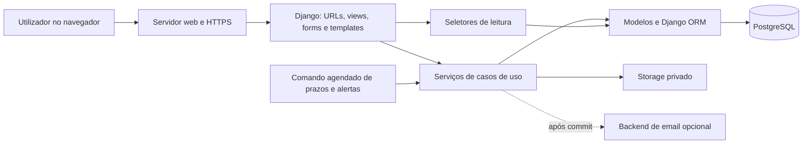
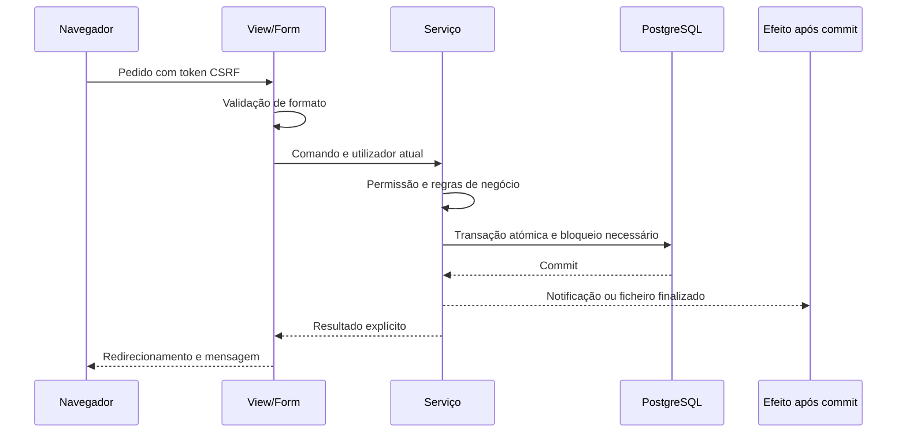

# Tópico 06 - Arquitetura técnica

## 1. Objetivo e estado

Este documento define como o Forma Flow será construído em Python e Django: estilo arquitetural, aplicações internas, camadas, dependências, persistência, segurança, ficheiros, tarefas, testes e ambientes.

O Tópico 6 fica dividido em duas partes:

- **Parte A — arquitetura e plano de implementação:** concluída por este documento e pelo [plano de implementação](06-plano-de-implementacao.md);
- **Parte B — execução:** criação do projeto, modelos, migrações, páginas e testes, ainda não autorizada.

Neste momento não são criados ficheiros Python, aplicações Django, ambientes virtuais, bases de dados nem dependências. A Parte B só começa depois de uma instrução explícita do responsável pelo projeto.

## 2. Entradas e limites

A arquitetura aplica as decisões já tomadas:

- âmbito e prioridades do [Tópico 1](01-ambito-e-objetivos.md);
- perfis, âmbitos e permissões do [Tópico 2](02-perfis-e-permissoes.md);
- regras e parâmetros do [Tópico 3](03-regras-de-negocio.md);
- máquina de estados do [Tópico 4](04-fluxo-e-estados.md);
- 38 entidades e respetivas restrições do [Tópico 5](05-modelo-de-dados.md).

Continuam fora do MVP:

- substituição do Iefponline ou tomada automática de decisões oficiais;
- integração automática com IEFP, DGERT, SIGO, Autoridade Tributária ou Segurança Social;
- aplicação móvel nativa;
- arquitetura de microserviços;
- motor genérico de workflows configurável por utilizadores;
- processamento de dados pessoais reais antes de existir política legal e operacional aprovada.

## 3. Decisões arquiteturais principais

| Área | Decisão | Consequência |
| --- | --- | --- |
| Estilo | Monólito modular Django | Um único projeto para instalar e demonstrar, com módulos de negócio separados |
| Interface | Páginas renderizadas no servidor com Django Templates | Menor complexidade do que uma SPA e validação partilhada com formulários Django |
| API | Não existe API pública no MVP | As regras ficam em serviços para permitir API futura sem reescrever o domínio |
| Base de dados | PostgreSQL em desenvolvimento, testes de integração e produção | As restrições, índices e transações têm comportamento coerente entre ambientes |
| ORM | Django ORM | Não será criada uma camada de repositórios que apenas duplique o ORM |
| Autenticação | Modelo de utilizador próprio desde a primeira migração, com email como login | Evita migração tardia do utilizador e suporta os perfis do Tópico 2 |
| Autorização | Grupos globais mais verificação de âmbito por empresa, candidatura e titular | Uma permissão global nunca dá acesso automático a todos os objetos |
| Escritas | Serviços de caso de uso com transações explícitas | Mudanças relacionadas são atómicas e testáveis |
| Leituras | Seletores com consultas otimizadas e filtradas pelo utilizador | Evita repetir regras de visibilidade em várias páginas |
| Ficheiros | Armazenamento privado através da API de storage do Django | O backend pode mudar sem alterar o significado de `VersaoDocumento` |
| Alertas | Notificações persistidas e comando agendado idempotente | O MVP não fica dependente de uma fila externa |
| Auditoria | Eventos explícitos nas operações sensíveis | O histórico administrativo não é confundido com logs técnicos |
| Localização | Português de Portugal e fuso `Europe/Lisbon` | Datas são guardadas com fuso e apresentadas de forma consistente |
| Entrega | Incrementos verticais pequenos, testados e enviados ao GitHub | O ramo principal permanece executável após cada incremento |

## 4. Base tecnológica planeada

### 4.1. Política de versões

A referência técnica foi verificada em 2 de setembro de 2026. A base preferencial para iniciar a implementação é:

| Componente | Linha planeada | Política |
| --- | --- | --- |
| Python | 3.13, última correção disponível | Versão madura, suportada pelo Django escolhido e isolada em `.venv` |
| Django | 5.2 LTS, última correção disponível | Suporte de segurança oficial até abril de 2028 |
| PostgreSQL | 17, última correção disponível | Suporte oficial até novembro de 2029 |
| Adaptador PostgreSQL | `psycopg`, versão compatível fixada | Atualizado dentro da linha compatível após testes |

Não serão usados lançamentos de desenvolvimento. Antes do primeiro ficheiro de código serão confirmadas as versões realmente disponíveis no computador. As versões exatas ficarão fixadas no repositório e qualquer atualização terá testes e commit próprios.

### 4.2. Dependências iniciais

O núcleo deverá começar com poucas dependências:

- Django;
- adaptador PostgreSQL;
- biblioteca para carregar configuração local por variáveis de ambiente, apenas se trouxer vantagem clara;
- Ruff para formatação e análise estática;
- ferramenta de cobertura de testes;
- biblioteca de cifragem apenas quando for implementado o IBAN.

Não entram inicialmente Celery, Redis, Django REST Framework, um framework JavaScript de SPA ou uma biblioteca genérica de máquina de estados. Só serão adicionados perante uma necessidade demonstrada e com registo da decisão.

## 5. Visão geral da solução



O navegador nunca comunica diretamente com a base de dados ou o storage. Views recebem pedidos HTTP, formulários validam a forma dos dados, serviços executam operações de negócio e seletores devolvem apenas os objetos que o utilizador pode consultar.

## 6. Monólito modular

### 6.1. Aplicações planeadas

| Aplicação | Responsabilidade | Entidades principais |
| --- | --- | --- |
| `core` | Tipos comuns, utilitários, erros, saúde e componentes sem negócio | Nenhuma entidade de negócio |
| `contas` | Autenticação e identidade do candidato | `Utilizador`, `PerfilCandidato` |
| `organizacoes` | Empresas, acessos, vínculos, contas bancárias e formadoras | 6 entidades |
| `regras` | Versões de regras, parâmetros, calendário e catálogo documental | 4 entidades |
| `formacoes` | Ações e componentes de formação | 2 entidades |
| `candidaturas` | Candidatura, beneficiários, participações, atribuições e elegibilidade | 5 entidades |
| `documentos` | Requisitos, ficheiros, versões e snapshots | 5 entidades |
| `workflow` | Transições, pedidos, prazos, tarefas e notificações | 10 entidades |
| `financeiro` | Apoios, movimentos e restituições | 3 entidades |
| `auditoria` | Registo técnico de operações sensíveis | 1 entidade |

A distribuição exata das 38 entidades encontra-se no plano de implementação. A separação cria fronteiras compreensíveis sem transformar o projeto numa rede de serviços independentes.

### 6.2. Estrutura planeada do repositório

```text
FormaFlow/
├── manage.py
├── pyproject.toml
├── requirements/
│   ├── base.txt
│   └── development.txt
├── .env.example
├── config/
│   ├── settings/
│   │   ├── base.py
│   │   ├── local.py
│   │   ├── test.py
│   │   └── production.py
│   ├── urls.py
│   ├── asgi.py
│   └── wsgi.py
├── apps/
│   ├── core/
│   ├── contas/
│   ├── organizacoes/
│   ├── regras/
│   ├── formacoes/
│   ├── candidaturas/
│   ├── documentos/
│   ├── workflow/
│   ├── financeiro/
│   └── auditoria/
├── templates/
├── static/
├── tests/
├── scripts/
└── docs/
```

Esta árvore é uma especificação, não a criação antecipada de diretórios. As migrações ficam dentro da aplicação respetiva; os ficheiros carregados e os segredos ficam fora do controlo de versões.

### 6.3. Estrutura interna de uma aplicação

Cada aplicação começa simples e só ganha novos módulos quando o volume o justificar:

```text
aplicacao/
├── models.py
├── admin.py
├── forms.py
├── urls.py
├── views.py
├── selectors.py
├── services.py
├── migrations/
└── tests/
    ├── test_models.py
    ├── test_services.py
    ├── test_permissions.py
    └── test_views.py
```

Se um ficheiro se tornar demasiado grande, será dividido por funcionalidade, mantendo uma API pública clara no módulo. Não serão criadas pastas e abstrações vazias apenas para imitar projetos maiores.

## 7. Camadas e responsabilidades

| Camada | Pode fazer | Não deve fazer |
| --- | --- | --- |
| Template | Apresentar dados, estados e erros já preparados | Consultar ORM, decidir permissões ou alterar dados |
| View | Autenticar, verificar pedido, usar form, chamar serviço ou seletor e escolher resposta | Implementar cálculos financeiros ou transições |
| Form | Validar tipos, obrigatoriedade e coerência do pedido do utilizador | Alterar vários agregados ou decidir acontecimentos oficiais |
| Serviço | Executar caso de uso, autorizar âmbito, abrir transação, criar histórico e efeitos | Renderizar HTML ou depender de detalhes da view |
| Seletor | Construir leituras filtradas, `select_related`, `prefetch_related` e resumos | Alterar dados |
| Modelo | Representar dados, restrições locais e métodos pequenos sem efeitos externos | Enviar email, mudar vários agregados ou conhecer o pedido HTTP |
| Adaptador | Comunicar com storage, email, relógio ou futura integração externa | Conter regras centrais de candidatura |

### 7.1. Fluxo de uma escrita



Erros de domínio terão códigos estáveis e mensagens apropriadas para a interface. A view não deverá inferir o resultado através de exceções genéricas.

### 7.2. Regras de dependência

- `core` não importa aplicações de negócio.
- `contas` depende apenas de `core` e componentes nativos de autenticação.
- módulos de leitura não chamam módulos de escrita.
- serviços podem coordenar modelos da própria aplicação e serviços públicos de outras aplicações.
- views de uma aplicação não importam views de outra.
- regras de negócio críticas não ficam escondidas em sinais de modelo.
- imports circulares de Python são proibidos.
- FK entre aplicações usam referências tardias; migrações cruzadas são ordenadas explicitamente.
- integrações externas entram por adaptadores e nunca diretamente nos modelos.

Existem algumas relações circulares no modelo relacional, sobretudo evidências documentais ligadas a vínculos, contas e certificações. Isso não autoriza dependências circulares no código. As FK de evidência serão adicionadas numa migração posterior, depois de existirem as tabelas documentais.

## 8. Autenticação e autorização

### 8.1. Autenticação

- `Utilizador` será o modelo configurado desde a primeira migração.
- O email normalizado será o identificador de entrada.
- Palavras-passe usarão os mecanismos do Django, nunca cifragem própria.
- Recuperação de palavra-passe não revelará se um email está registado.
- Contas desativadas mantêm autoria e histórico.
- O administrador Django será uma ferramenta técnica, não a interface normal do Gestor/RH.

### 8.2. Autorização em três níveis

Uma operação só é permitida quando passam os três níveis aplicáveis:

1. **papel global:** candidato, Gestor/RH ou administrador;
2. **âmbito:** titularidade, `AssociacaoEmpresa` ou `AtribuicaoCandidatura` ativa;
3. **estado do objeto:** a máquina de estados e as regras permitem a ação naquele momento.

Os seletores começam sempre pelo conjunto visível ao utilizador. Não se consulta um objeto global para só depois esconder o resultado. Respostas a objetos fora do âmbito não confirmam a sua existência.

### 8.3. Matriz obrigatória de testes

Cada operação sensível terá testes positivos e negativos para:

- titular correto e titular diferente;
- gestor da empresa e gestor de outra empresa;
- responsável atribuído e utilizador não atribuído;
- administrador autorizado;
- utilizador anónimo ou inativo;
- estado permitido e estado incompatível.

## 9. Persistência, consistência e transações

### 9.1. PostgreSQL como comportamento de referência

SQLite não será usado como substituto silencioso nos testes principais, porque restrições parciais, concorrência e bloqueios podem comportar-se de forma diferente. Uma verificação rápida local com SQLite só poderá existir se estiver identificada como limitada.

### 9.2. Operações atómicas

Serão transacionais, entre outras:

- criação da candidatura individual e do seu beneficiário;
- alteração do estado com criação de `TransicaoCandidatura` e incremento de versão;
- substituição da versão corrente de um documento;
- submissão com criação de snapshot;
- abertura ou resposta completa a pedido de elementos;
- cálculo de prazo e criação dos alertas correspondentes;
- confirmação de valor oficial e respetivo movimento.

As transações serão curtas. O envio de email, processamento pesado e comunicação externa só ocorrem depois de um commit bem-sucedido.

### 9.3. Concorrência

- `Candidatura.versao` aplica bloqueio otimista à edição comum.
- Transições usam bloqueio da candidatura durante a operação crítica.
- Restrições únicas permanecem a última defesa contra duplicados.
- Chaves de idempotência são verificadas dentro da mesma transação.
- Um conflito apresenta uma mensagem para atualizar os dados, em vez de substituir silenciosamente alterações.

### 9.4. Dados derivados

Estado, totais e indicadores derivados são atualizados apenas por serviços definidos. Sempre deve existir uma consulta ou função capaz de os reconstruir a partir das fontes de verdade do Tópico 5.

## 10. Workflow, tarefas e notificações

### 10.1. Máquina de estados

As transições `TR-001` a `TR-023` terão um registo declarativo único com:

- estados de origem permitidos;
- estado de destino;
- papéis autorizados;
- validações prévias;
- efeitos criados na transação;
- código de auditoria.

Os serviços chamam este registo; views, comandos e futura API não implementam versões próprias da máquina.

### 10.2. Alertas agendados

O primeiro mecanismo será um comando de gestão idempotente que:

1. seleciona prazos ativos;
2. calcula limiares ultrapassados;
3. cria notificações com chave de deduplicação;
4. fecha ou resolve avisos que deixaram de ser aplicáveis;
5. regista o resumo da execução sem dados pessoais sensíveis.

O comando poderá ser executado manualmente na demonstração e por um agendador no ambiente publicado. Celery e Redis só serão avaliados se surgirem volume, latência ou integrações que justifiquem essa infraestrutura.

### 10.3. Entrega de mensagens

- A notificação interna persistida é a fonte de verdade do MVP.
- Email é um canal adicional e a sua falha não anula a operação de negócio.
- O envio é solicitado depois do commit.
- Mensagens não incluem NIF, IBAN, anexos ou decisões detalhadas.
- Tentativas e falhas técnicas são registadas sem duplicar a notificação de negócio.

## 11. Ficheiros e documentos

### 11.1. Ciclo de upload

1. verificar autenticação e âmbito;
2. aplicar limite configurado de tamanho;
3. validar extensão, assinatura do conteúdo e tipo MIME;
4. atribuir chave aleatória e guardar em zona privada ou temporária;
5. calcular hash e executar a análise de segurança disponível;
6. criar `FicheiroArmazenado` e `VersaoDocumento` na operação controlada;
7. disponibilizar apenas por uma view de download com nova autorização;
8. remover ficheiros temporários órfãos por rotina segura.

O limite inicial de 2 MB e o formato PDF vêm das regras de referência, não ficam escritos diretamente nas views.

### 11.2. Abstração de storage

- desenvolvimento: diretório privado fora de `static` e fora do Git;
- testes: storage temporário isolado;
- produção: volume privado persistente ou serviço de objetos compatível;
- acesso: nome interno aleatório, nunca nome enviado pelo utilizador;
- substituição: muda a versão corrente sem destruir a versão histórica.

A escolha do backend de produção fica para a preparação de publicação; o domínio usa apenas a interface de storage.

## 12. Interface web

### 12.1. Estratégia

O MVP usa HTML renderizado pelo Django, formulários nativos e JavaScript apenas para melhorias progressivas. As operações essenciais continuarão possíveis sem depender de uma aplicação JavaScript complexa.

### 12.2. Estrutura visual comum

- layout base com cabeçalho, navegação, mensagens e conteúdo;
- menu adaptado ao papel e ao âmbito;
- componentes reutilizáveis para estado, prioridade, prazo e checklist;
- formulários com erros junto ao campo e resumo acessível;
- tabelas com filtros no servidor e paginação;
- páginas de erro 403, 404 e 500 sem informação interna;
- contraste, navegação por teclado, etiquetas e foco visível.

### 12.3. Endereços

- namespaces por aplicação;
- nomes de URL estáveis, usados por reversão e não escritos manualmente;
- `public_id` em endereços de candidaturas e documentos;
- nenhum NIF, NIPC, email, IBAN, nome de ficheiro ou chave de storage no URL;
- operações de alteração por `POST`, com CSRF e redirecionamento após sucesso.

## 13. Configuração e ambientes

### 13.1. Perfis de configuração

| Perfil | Finalidade | Características |
| --- | --- | --- |
| `base` | Valores comuns seguros | Aplicações, localização, templates e middleware comum |
| `local` | Desenvolvimento | Debug controlado, email em consola e storage privado local |
| `test` | Testes automatizados | Serviços externos falsos, storage temporário e execução previsível |
| `production` | Publicação | Debug desligado, HTTPS, cookies seguros, logs e hosts explícitos |

### 13.2. Variáveis externas

Serão fornecidos externamente pelo menos:

- chave secreta;
- estado de debug;
- hosts e origens confiáveis;
- ligação à base de dados;
- credenciais e localização do storage;
- configuração de email;
- chave de cifragem de campos sensíveis;
- nível de logs.

O repositório terá apenas `.env.example` sem valores secretos. O ficheiro `.env`, a base de dados local, `.venv`, uploads, caches e logs estarão ignorados pelo Git.

## 14. Segurança por defeito

### 14.1. Aplicação

- proteção CSRF ativa;
- escaping de templates mantido por defeito;
- validação no servidor em todas as entradas;
- sessões e cookies com opções seguras no ambiente publicado;
- proteção contra tentativas repetidas de autenticação avaliada antes da publicação;
- mensagens de erro sem detalhes de base de dados, caminhos ou segredos;
- downloads autorizados em cada pedido;
- ações administrativas e exportações auditadas.

### 14.2. Dados

- princípio do menor privilégio na conta PostgreSQL;
- backups cifrados e teste de restauro;
- NIF e IBAN mascarados na interface e ausentes dos logs;
- IBAN cifrado na aplicação e comparado por hash;
- dados fictícios em desenvolvimento, testes e apresentação;
- retenção e anonimização definidas antes de dados reais.

### 14.3. Dependências e publicação

- versões exatas registadas;
- atualizações de segurança aplicadas em commits próprios;
- verificação de dependências antes de publicar;
- `manage.py check --deploy` no ambiente de produção;
- servidor próprio de produção atrás de HTTPS, nunca `runserver` exposto.

## 15. Registos, auditoria e observabilidade

### 15.1. Logs técnicos

Os logs incluem data, nível, ambiente, ação, identificador de correlação e resultado. Não incluem corpo de documentos, credenciais, tokens, NIF, IBAN completo ou formulários integrais.

Níveis previstos:

- `INFO`: arranque, execução de comando e resultado agregado;
- `WARNING`: tentativa recusada, prazo incoerente ou serviço externo indisponível;
- `ERROR`: falha inesperada com identificador de correlação;
- `DEBUG`: apenas local, sem dados pessoais.

### 15.2. Auditoria de negócio

`RegistoAuditoria` é criado explicitamente por serviços para login relevante, consulta ou download sensível, alteração de permissões, transição, correção, decisão e movimento financeiro. `TransicaoCandidatura` continua a ser a fonte de verdade do histórico administrativo.

### 15.3. Verificações de saúde

O ambiente publicado deverá conseguir confirmar, sem expor informação interna:

- aplicação em execução;
- ligação à base de dados;
- capacidade de acesso ao storage;
- última execução do processamento de alertas.

## 16. Estratégia de testes

| Nível | Objetivo | Exemplos |
| --- | --- | --- |
| Unidade | Regras puras e cálculos rápidos | Dias úteis, limites, estados derivados, apoio estimado |
| Modelo | Restrições locais e validação de campos | Exclusividade do titular, valores positivos, unicidades |
| Serviço | Caso de uso completo com transação | Submeter, transitar, versionar documento, responder pedido |
| Permissão | Isolamento entre âmbitos | Empresas diferentes, titular errado, conta inativa |
| View | HTTP, formulários e templates | Redirecionamentos, CSRF, erros e paginação |
| Integração | PostgreSQL, storage e callback pós-commit | Bloqueios, índices condicionais, download privado |
| Percurso crítico | Fluxo demonstrável de ponta a ponta | Rascunho até encerramento com pedido adicional |

Prioridades de cobertura:

- 100% das transições da máquina de estados com caminho permitido e recusado;
- 100% das regras de cálculo financeiro implementadas;
- todas as operações sensíveis com teste de âmbito negativo;
- todas as restrições de integridade importantes exercitadas na base de dados;
- percursos principais sem depender de dados reais ou serviços externos.

A percentagem global de cobertura será observada, mas não substituirá testes de comportamento significativo.

## 17. Qualidade e integração contínua

Antes de cada commit de implementação deverão passar as verificações aplicáveis:

1. formatação e análise estática;
2. verificação de configuração do Django;
3. confirmação de que os modelos não geram migrações esquecidas;
4. testes automatizados;
5. verificação de links ou documentação quando alterada;
6. inspeção do diff para excluir segredos e dados pessoais.

O GitHub poderá executar o mesmo conjunto em cada envio. As migrações fazem parte do código e são sempre versionadas.

## 18. Ambientes e publicação

### 18.1. Desenvolvimento

- ambiente virtual isolado;
- PostgreSQL local ou serviço de desenvolvimento equivalente;
- email apresentado na consola;
- ficheiros privados numa pasta ignorada;
- dados fictícios carregados por comando repetível.

### 18.2. Testes

- base PostgreSQL separada e descartável;
- storage temporário;
- relógio e adaptadores controláveis;
- nenhum envio real de email.

### 18.3. Demonstração

- conjunto de dados fictício e estável;
- contas de cada perfil preparadas sem credenciais publicadas no Git;
- percurso principal ensaiado;
- alternativa local caso a Internet esteja indisponível.

### 18.4. Produção futura

- processo web adequado para WSGI ou ASGI;
- proxy com HTTPS;
- PostgreSQL e storage persistentes;
- cópias de segurança automáticas;
- logs centralizados e rotação;
- comando de alertas agendado;
- procedimento de migração, restauro e reversão documentado.

A plataforma de alojamento não é escolhida nesta fase para não adaptar o desenho a um fornecedor antes de conhecer custos e limitações.

## 19. Estratégia de falhas

| Falha | Comportamento esperado |
| --- | --- |
| Validação de formulário | Não grava; apresenta campos a corrigir |
| Regra de negócio recusada | Transação revertida; mensagem clara; tentativa auditada quando sensível |
| Conflito concorrente | Não substitui dados; pede atualização da página |
| Upload interrompido | Não cria versão válida; temporário é limpo posteriormente |
| Email indisponível | Operação mantém-se; envio fica pendente ou falhado |
| Comando repetido | Chaves de deduplicação impedem novas notificações equivalentes |
| Base de dados indisponível | Resposta genérica; erro correlacionado; nenhuma operação parcial |
| Storage indisponível | Download ou upload recusado sem alterar estado documental |
| Migração falhada | Publicação interrompida e procedimento de recuperação executado |

## 20. Registo de decisões

Decisões arquiteturais que alterem esta base serão registadas em documentos curtos com:

- contexto e problema;
- opções consideradas;
- decisão e motivo;
- consequências e forma de reversão;
- data e commit.

Exigem registo, por exemplo, adicionar API pública, fila assíncrona, novo backend de storage, integração externa ou divisão em serviços. Uma simples organização interna de ficheiros não precisa de um documento formal.

## 21. Critérios de aceitação do Tópico 6A

O planeamento técnico considera-se concluído porque:

1. existe uma arquitetura adequada à dimensão da PAP;
2. as 38 entidades têm aplicação responsável;
3. camadas de leitura, escrita, apresentação e integração estão separadas;
4. autenticação e autorização por âmbito começam no desenho;
5. transações, concorrência e idempotência têm estratégia explícita;
6. documentos privados não dependem de caminhos públicos;
7. alertas funcionam no MVP sem infraestrutura desnecessária;
8. ambientes e segredos estão separados;
9. testes cobrem regras, estados, permissões e percursos críticos;
10. dependências circulares do modelo têm ordem de migração planeada;
11. cada incremento futuro tem verificação e commit próprios;
12. nenhuma implementação foi iniciada sem autorização.

## 22. Fontes técnicas consultadas

- [Django — versões disponíveis e períodos de suporte](https://www.djangoproject.com/download/), consulta em 2 de setembro de 2026.
- [Django — personalização do modelo de utilizador](https://docs.djangoproject.com/en/6.1/topics/auth/customizing/).
- [Django 5.2 — transações e ações após commit](https://docs.djangoproject.com/en/5.2/topics/db/transactions/).
- [Django 5.2 — gestão de ficheiros](https://docs.djangoproject.com/en/5.2/topics/files/).
- [Django 5.2 — testes](https://docs.djangoproject.com/en/5.2/topics/testing/overview/).
- [Django 5.2 — lista de verificação de publicação](https://docs.djangoproject.com/en/5.2/howto/deployment/checklist/).
- [PostgreSQL — política de versões](https://www.postgresql.org/support/versioning/), consulta em 2 de setembro de 2026.

## 23. Resultado

O Forma Flow fica preparado para iniciar código sem voltar a decidir a estrutura a cada funcionalidade. O [plano de implementação](06-plano-de-implementacao.md) transforma esta arquitetura numa sequência verificável de incrementos. A execução permanece pendente até existir autorização explícita para começar a programar.
