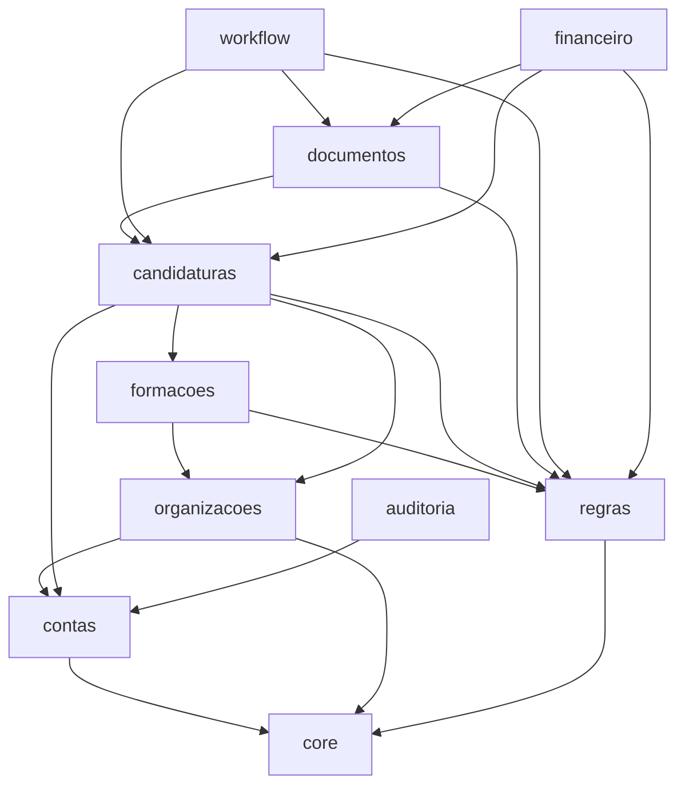

# Tópico 06 - Plano de implementação

## 1. Finalidade e autorização

Este documento converte a [arquitetura técnica](06-arquitetura-tecnica.md) numa ordem concreta de implementação. Permite pedir e executar o trabalho por partes, com uma definição de concluído para cada uma.

É apenas planeamento. Nenhum incremento abaixo está autorizado automaticamente. O primeiro ficheiro Python só será criado depois de uma instrução explícita para começar o código.

## 2. Mapa definitivo das aplicações

| Aplicação | Entidades | Quantidade |
| --- | --- | ---: |
| `contas` | `Utilizador`, `PerfilCandidato` | 2 |
| `organizacoes` | `Empresa`, `AssociacaoEmpresa`, `VinculoLaboral`, `ContaPagamento`, `EntidadeFormadora`, `CertificacaoFormadora` | 6 |
| `regras` | `ConjuntoRegras`, `ParametroRegra`, `Feriado`, `TipoDocumento` | 4 |
| `formacoes` | `AcaoFormacao`, `ComponenteFormacao` | 2 |
| `candidaturas` | `Candidatura`, `AtribuicaoCandidatura`, `BeneficiarioCandidatura`, `ParticipacaoFormacao`, `VerificacaoElegibilidade` | 5 |
| `documentos` | `FicheiroArmazenado`, `RequisitoDocumento`, `Documento`, `VersaoDocumento`, `SnapshotSubmissao` | 5 |
| `workflow` | `TransicaoCandidatura`, `PedidoElementos`, `QuestaoPedido`, `RespostaQuestao`, `TermoAceitacao`, `PedidoEncerramento`, `Prazo`, `SuspensaoPrazo`, `Tarefa`, `Notificacao` | 10 |
| `financeiro` | `ApoioFinanceiro`, `MovimentoFinanceiro`, `Restituicao` | 3 |
| `auditoria` | `RegistoAuditoria` | 1 |
| **Total** |  | **38** |

`core` é uma aplicação técnica sem entidades de negócio. Aloja apenas componentes realmente partilhados, como erros comuns, página de saúde e abstrações pequenas de tempo ou identificação.

## 3. Responsabilidade pública de cada aplicação

### 3.1. `core`

- disponibilizar utilitários sem conhecimento do domínio;
- definir tipos de resultado e erros comuns, se forem necessários;
- disponibilizar relógio substituível em testes;
- implementar verificações de saúde sem dados sensíveis.

Não pode tornar-se um depósito de código sem dono.

### 3.2. `contas`

- autenticar por email;
- gerir ativação e perfil do candidato;
- expor seletores de identidade para outras aplicações;
- nunca decidir acesso a uma empresa ou candidatura isoladamente.

### 3.3. `organizacoes`

- gerir empresas e associações de acesso;
- conservar vínculos laborais históricos;
- gerir contas de pagamento com mascaramento;
- registar formadoras e certificações;
- expor a verificação do âmbito empresarial.

### 3.4. `regras`

- publicar versões imutáveis de regras;
- validar tipos de parâmetros;
- calcular calendário útil;
- fornecer o conjunto aplicável a uma data;
- gerir o catálogo de tipos documentais.

### 3.5. `formacoes`

- gerir ações e componentes;
- calcular tipologia e total de horas;
- validar coerência CNQ e extra-CNQ;
- não conhecer estados da candidatura.

### 3.6. `candidaturas`

- criar candidaturas e respetivos beneficiários;
- gerir equipa atribuída e participações em formação;
- executar verificações de elegibilidade;
- fornecer a raiz transacional do processo;
- delegar transições à aplicação `workflow`.

### 3.7. `documentos`

- gerar checklists a partir das regras;
- receber, validar e versionar ficheiros;
- autorizar downloads privados;
- criar snapshots imutáveis;
- nunca avançar o estado administrativo sem chamar o caso de uso apropriado.

### 3.8. `workflow`

- aplicar as transições `TR-001` a `TR-023`;
- criar pedidos, questões, respostas, termo e encerramento;
- calcular e suspender prazos;
- criar tarefas e notificações sem duplicados;
- disponibilizar o comando de processamento periódico.

### 3.9. `financeiro`

- calcular estimativas identificadas como tal;
- registar valores oficiais separadamente;
- gerir movimentos e restituições;
- derivar a situação financeira sem fabricar decisões externas.

### 3.10. `auditoria`

- guardar eventos técnicos imutáveis;
- oferecer uma função explícita e limitada para criar eventos;
- filtrar metadados permitidos;
- disponibilizar consulta apenas a administradores autorizados.

## 4. Dependências entre aplicações

As setas representam dependências normais de código. As referências documentais que apontam no sentido inverso são relações tardias de persistência e não permitem que serviços de `organizacoes` passem a depender dos serviços de `documentos`.

Regras adicionais:

- `auditoria` pode receber identificadores e metadados mínimos, mas as outras aplicações não consultam modelos de auditoria para tomar decisões;
- `workflow` coordena candidatura e documentos, evitando chamadas de retorno de `documentos` para `workflow`;
- `financeiro` reage a casos de uso explícitos, não a sinais ocultos;
- uma dependência nova entre aplicações exige atualizar este diagrama.

## 5. Ondas de migração previstas

As relações cruzadas serão criadas numa ordem que evita ciclos de migração.

| Onda | Tabelas ou relações | Dependência e resultado |
| --- | --- | --- |
| M0 | Projeto, `core` e `Utilizador` | O utilizador próprio existe antes da primeira migração geral |
| M1 | `PerfilCandidato`, organizações sem evidências, regras e catálogos | Cria identidade e referências independentes |
| M2 | Ações, componentes, candidaturas, beneficiários, participações e verificações sem evidência | Cria o núcleo do processo |
| M3 | Ficheiros, requisitos, documentos, versões e snapshot sem FK para transição | Torna disponível o sistema documental |
| M4 | FK de evidência em vínculo, conta, certificação e elegibilidade | Completa relações que apontam para versões documentais |
| M5 | Transições, pedidos, termo, encerramento, prazos, tarefas e notificações | Cria o workflow já dependente de documentos |
| M6 | FK opcional de snapshot para transição | Fecha a relação circular de forma controlada |
| M7 | Apoios, movimentos, restituições e auditoria | Completa finanças e rastreabilidade |
| M8 | Índices condicionais e otimizações comprovadas | Aplicada depois das consultas e restrições funcionarem |

Cada onda terá migração, teste de aplicação numa base vazia e teste de atualização a partir da onda anterior. Nunca se edita uma migração já partilhada para esconder um problema.

## 6. Incrementos de execução

### IMP-00 — Preparar a base do projeto

Objetivo: criar um projeto vazio, executável e reproduzível.

Entregáveis futuros:

- ambiente e versões confirmados;
- estrutura `config`, `apps`, templates e static;
- configurações `base`, `local`, `test` e `production`;
- PostgreSQL configurado por variáveis de ambiente;
- `.gitignore` e `.env.example` seguros;
- Ruff, testes e comando de verificação;
- página de saúde mínima e README de instalação.

Concluído quando:

- uma instalação limpa consegue arrancar com instruções do README;
- não existem segredos, `.venv`, base local ou uploads no Git;
- as verificações e o primeiro teste passam;
- existe um commit e envio próprios.

### IMP-01 — Identidade e autenticação

Objetivo: criar o utilizador próprio e os perfis básicos antes das restantes migrações.

Entregáveis futuros:

- `Utilizador` e `PerfilCandidato`;
- entrada e saída por email;
- ativação, recuperação de acesso e administração técnica mínima;
- grupos iniciais do Tópico 2;
- layout autenticado básico.

Concluído quando:

- migrações funcionam numa base vazia;
- email normalizado é único;
- utilizador inativo não entra;
- permissões e recuperação não revelam contas;
- testes positivos e negativos passam.

### IMP-02 — Organizações, regras e dados de referência

Objetivo: criar a informação base necessária a uma candidatura.

Entregáveis futuros:

- empresas, associações, vínculos, contas mascaradas e formadoras;
- conjuntos de regras, parâmetros, feriados e tipos documentais;
- serviços de publicação imutável de regras;
- dados fictícios mínimos e parâmetros do Tópico 3;
- páginas administrativas controladas.

Concluído quando:

- gestor de uma empresa não consulta outra;
- exclusividade de proprietário da conta é garantida;
- versões publicadas das regras não são editáveis;
- calendários úteis têm testes de limites e feriados;
- nenhum NIF ou IBAN surge em logs ou URLs.

### IMP-03 — Formação e núcleo da candidatura

Objetivo: permitir preparar candidaturas individuais e empresariais em rascunho.

Entregáveis futuros:

- ações e componentes de formação;
- candidatura, atribuição, beneficiário, participação e elegibilidade;
- assistente de criação por etapas;
- cálculos derivados de tipologia e horas;
- controlo de versão da candidatura.

Concluído quando:

- existe exatamente um titular coerente;
- candidatura individual cria o único beneficiário correto;
- limite empresarial configurado é aplicado;
- participações e componentes respeitam as unicidades;
- edição concorrente não substitui dados silenciosamente.

### IMP-04 — Documentos, checklist e snapshots

Objetivo: gerir os comprovativos privados necessários à submissão.

Entregáveis futuros:

- checklist dinâmica;
- upload privado e validação de PDF/tamanho;
- documento lógico e versões;
- substituição sem perda do histórico;
- download autorizado e auditado;
- snapshot imutável da submissão.

Concluído quando:

- documentos de outra candidatura nunca ficam acessíveis;
- uma versão corrente é única;
- ficheiro inválido não satisfaz requisito;
- snapshot mantém as versões exatas mesmo após substituição;
- temporários e falhas não deixam registos válidos órfãos.

### IMP-05 — Máquina de estados e análise

Objetivo: implementar preparação, submissão, análise e decisões.

Entregáveis futuros:

- registo declarativo de `TR-001` a `TR-012`;
- histórico imutável e bloqueio concorrente;
- pedidos de elementos, questões e respostas;
- suspensão e retoma de prazos;
- decisão por beneficiário e resultado global;
- tarefas e notificações associadas.

Concluído quando:

- todas as transições têm testes de aceitação e recusa;
- não existe estado alterado sem transição;
- pedido completo suspende e retoma o prazo correto;
- decisão parcial produz resultado global coerente;
- repetição do mesmo pedido não duplica efeitos.

### IMP-06 — Aceitação, acompanhamento e encerramento

Objetivo: completar o percurso administrativo posterior à aprovação.

Entregáveis futuros:

- transições `TR-013` a `TR-023`;
- termo, assinatura registada e prazo;
- estados reais das participações;
- preparação e submissão do encerramento;
- pedidos adicionais na fase final;
- correção administrativa preservando o erro original.

Concluído quando:

- termo fora de prazo gera alerta sem inventar decisão;
- encerramento exige documentos finais válidos;
- estados terminais bloqueiam edição normal;
- revogação e correção deixam histórico completo;
- percurso favorável e percursos excecionais são demonstráveis.

### IMP-07 — Financeiro

Objetivo: separar estimativas, aprovações, pagamentos e restituições.

Entregáveis futuros:

- calculadores versionados pelos parâmetros aplicáveis;
- apoios por beneficiário e participação;
- movimentos previstos e confirmados;
- restituições apenas com decisão oficial;
- resumos financeiros e respetiva autorização.

Concluído quando:

- estimativa nunca aparece como valor aprovado;
- fórmulas e limites do Tópico 3 têm testes de fronteira;
- totais consideram apenas movimentos corretos;
- duplicação de pagamento é impedida por idempotência;
- valores individuais não são expostos a outro âmbito.

### IMP-08 — Dashboard, alertas e relatórios do MVP

Objetivo: tornar o acompanhamento diário e a demonstração claros.

Entregáveis futuros:

- dashboard filtrado por papel;
- filtros, paginação, checklist e próxima ação;
- comando idempotente de prazos e alertas;
- notificações internas e email opcional;
- exportações mínimas autorizadas;
- consultas otimizadas e índices comprovados.

Concluído quando:

- cada perfil vê apenas informação útil e autorizada;
- indicadores são reconstruíveis das fontes de verdade;
- executar o comando duas vezes não duplica avisos;
- listas principais não geram consultas repetidas por linha;
- exportações são auditadas e não incluem campos desnecessários.

### IMP-09 — Robustez, demonstração e publicação

Objetivo: preparar uma entrega reproduzível da PAP.

Entregáveis futuros:

- revisão integral de segurança e permissões;
- teste de instalação limpa e migrações;
- dados fictícios de demonstração;
- testes do percurso crítico;
- backup e restauro ensaiados;
- documentação técnica, instalação e utilizador atualizada;
- configuração do ambiente de demonstração ou publicação.

Concluído quando:

- todas as verificações automatizadas passam;
- `check --deploy` não apresenta bloqueios no ambiente final;
- o percurso de demonstração funciona sem Internet externa;
- existe procedimento de recuperação;
- relatório e apresentação correspondem ao sistema entregue.

## 7. Ordem de pedidos depois da autorização

A implementação deve ser pedida e executada nesta sequência:

1. `IMP-00` — base do projeto;
2. `IMP-01` — identidade;
3. `IMP-02` — organizações e regras;
4. `IMP-03` — formação e candidatura;
5. `IMP-04` — documentos;
6. `IMP-05` — análise e primeira parte do workflow;
7. `IMP-06` — aceitação e encerramento;
8. `IMP-07` — financeiro;
9. `IMP-08` — dashboard e alertas;
10. `IMP-09` — robustez e entrega.

Cada incremento pode ser subdividido se o diff deixar de ser fácil de rever. Não se inicia um incremento dependente enquanto o anterior não estiver testado e enviado.

## 8. Política de commits e GitHub

- cada alteração coerente recebe um commit descritivo;
- testes e migrações acompanham a funcionalidade que justificam a sua existência;
- documentação afetada é atualizada no mesmo incremento;
- o diff é revisto antes do commit;
- nenhum segredo ou dado pessoal é enviado;
- depois de validar, o commit é enviado ao repositório GitHub;
- o ramo principal deve ficar executável; trabalho incompleto não é disfarçado como concluído.

Padrões de mensagem planeados:

- `chore: preparar estrutura inicial do projeto`;
- `feat(contas): adicionar autenticação por email`;
- `feat(candidaturas): criar candidatura individual`;
- `test(workflow): cobrir transicoes de analise`;
- `docs: atualizar manual de instalacao`.

As mensagens de commit são técnicas e podem omitir acentos para compatibilidade; a documentação e a interface mantêm português correto.

## 9. Dados iniciais e demonstração

Os dados repetíveis serão divididos em:

- **catálogos necessários:** grupos, tipos documentais e configuração base;
- **regras de referência:** parâmetros do Tópico 3 marcados como demonstração;
- **cenários fictícios:** candidatos, empresa, formadora, formações e candidaturas criados apenas para desenvolvimento ou apresentação.

Requisitos:

- comandos repetíveis sem duplicação;
- nenhuma credencial fixa em fixtures públicas;
- nomes, NIF, NIPC, IBAN e documentos claramente fictícios;
- cenário individual favorável;
- cenário empresarial com decisão parcial;
- pedido de elementos com suspensão;
- encerramento e movimento financeiro;
- cenário de prazo urgente para demonstrar alertas.

## 10. Matriz mínima de rastreabilidade

| Origem | Prova na implementação |
| --- | --- |
| Objetivos do Tópico 1 | Percursos de demonstração e critérios do incremento |
| Permissões do Tópico 2 | Testes de âmbito positivos e negativos |
| Regras `RN-*` do Tópico 3 | Teste identificado pelo código da regra |
| Transições `TR-*` do Tópico 4 | Teste permitido, recusado e efeitos esperados |
| Entidades do Tópico 5 | Modelo, migração e restrição correspondente |
| Arquitetura do Tópico 6 | Verificação das dependências, camadas e ambientes |

Cada regra ou transição implementada deverá ser encontrável pelo respetivo código nos testes e na documentação.

## 11. Riscos de execução

| Risco | Sinal inicial | Resposta planeada |
| --- | --- | --- |
| Modelo demasiado grande para um incremento | Migração extensa e testes difíceis de localizar | Respeitar ondas e entregar fatias menores |
| Ciclo entre documentos e workflow | Migrações que dependem uma da outra | Criar FK tardia na onda seguinte |
| Regras espalhadas por views e forms | Mesmo cálculo repetido | Mover para serviço ou função pura com testes |
| Excesso de dependências | Instalação frágil ou configuração longa | Começar com núcleo mínimo e justificar cada pacote |
| Permissões só na interface | URL direta mostra objeto alheio | Filtrar seletor e testar pedidos diretos |
| Dados oficiais confundidos com estimativas | Dashboard não identifica origem | Campos, etiquetas e serviços separados |
| Uploads públicos | URL de media abre sem autorização | Storage privado e view de download |
| Alertas duplicados | Reexecução cria novas mensagens | Chave de deduplicação e teste idempotente |
| Projeto só funciona no computador original | Passos manuais não documentados | Instalação limpa e configuração externa |
| Demonstração depender da Internet | Serviço externo indisponível | Dados fictícios e percurso local completos |

## 12. Portões de decisão

Exigem autorização ou decisão explícita antes de executar:

- **G0 — começar código:** criar a estrutura de `IMP-00`;
- **G1 — dados reais:** abandonar exclusivamente dados fictícios;
- **G2 — serviços externos:** integrar com qualquer plataforma ou enviar email real;
- **G3 — publicação:** criar ou alterar recursos de alojamento com custos ou exposição pública;
- **G4 — alteração de âmbito:** adicionar API pública, aplicação móvel ou funcionalidades fora do Tópico 1.

A autorização de G0 não autoriza automaticamente G1 a G4.

## 13. Checklist antes de iniciar código

- [x] Âmbito e objetivos definidos.
- [x] Perfis e permissões definidos.
- [x] Regras de negócio identificadas como referência ou decisão interna.
- [x] Estados e transições definidos.
- [x] Modelo e dicionário de dados definidos.
- [x] Aplicações, camadas e dependências planeadas.
- [x] Ordem de migrações e incrementos planeada.
- [x] Estratégias de segurança, testes e ambientes definidas.
- [ ] Autorização explícita para começar código.
- [ ] Versões instaladas no computador confirmadas.
- [ ] Forma de executar PostgreSQL no desenvolvimento confirmada.

## 14. Resultado

O projeto pode avançar de forma controlada, começando por `IMP-00` quando existir autorização. Cada incremento tem fronteira, resultado verificável e compromisso de teste e commit, evitando uma implementação única demasiado grande para rever ou demonstrar.
