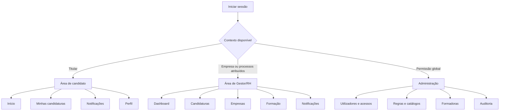

# Tópico 07 - Interface e experiência do utilizador

## 1. Objetivo e estado

Este documento define como os utilizadores irão navegar, compreender e operar o Forma Flow. Organiza a informação, os percursos, os padrões de formulários, a apresentação de estados, os componentes visuais, a adaptação a dispositivos e os critérios de acessibilidade.

Como o plano original terminava no Tópico 6, o Tópico 7 foi criado como extensão de planeamento antes da implementação. O detalhe de cada página encontra-se no [inventário de ecrãs e wireframes](07-inventario-e-wireframes.md).

Não são criados HTML, CSS, JavaScript, templates Django nem imagens neste tópico. Os wireframes são esquemas textuais de planeamento e não constituem um protótipo implementado.

## 2. Objetivos da experiência

O Forma Flow deverá permitir que uma pessoa consiga, sem conhecer a estrutura interna do sistema:

1. perceber em que ponto está cada candidatura;
2. identificar a próxima ação e quem é responsável;
3. distinguir validações internas de acontecimentos oficiais do IEFP;
4. preparar uma candidatura gradualmente, sem perder trabalho;
5. encontrar documentos em falta, inválidos ou próximos da validade;
6. responder a pedidos adicionais dentro do prazo;
7. acompanhar vários beneficiários sem misturar dados;
8. distinguir estimativas, valores aprovados e pagamentos;
9. recuperar de erros com instruções concretas;
10. realizar os percursos essenciais com teclado e tecnologias de apoio.

## 3. Princípios de desenho

### 3.1. Próxima ação antes do detalhe

O dashboard e a página da candidatura apresentam primeiro:

- estado atual;
- ação necessária;
- responsável;
- prazo e nível de urgência;
- bloqueios existentes.

O histórico completo e os detalhes técnicos continuam disponíveis, mas não ocupam o primeiro nível visual.

### 3.2. Uma origem claramente identificada

Cada informação relevante deve indicar se é:

- **rascunho interno**;
- **validação do Forma Flow**;
- **estimativa do Forma Flow**;
- **registo de acontecimento externo**;
- **decisão oficial comunicada pelo IEFP**.

As cores não substituem estas etiquetas. A interface nunca usa “aprovada” para um resultado apenas estimado.

### 3.3. Divulgar complexidade progressivamente

- listas mostram resumos e ações principais;
- cada candidatura tem uma visão geral e separadores temáticos;
- formulários longos são divididos em passos com significado;
- campos condicionais aparecem apenas quando se aplicam, mantendo explicação acessível;
- detalhes de cálculo ficam num painel próprio, sem esconder o total e a origem.

### 3.4. Guardar de forma explícita

Na primeira versão não existe gravação automática invisível. Cada passo usa ações claras:

- `Guardar rascunho`;
- `Guardar e continuar`;
- `Voltar sem guardar`;
- `Validar candidatura`;
- `Registar submissão no Iefponline`.

Depois de guardar, a interface confirma a operação e apresenta a hora. Se existirem alterações por guardar, sair da página deverá gerar aviso quando tecnicamente viável.

### 3.5. Prevenir erros antes de os corrigir

- ações indisponíveis indicam o motivo;
- datas e valores apresentam formato esperado;
- operações oficiais têm página de confirmação com resumo;
- arquivo, desistência, revogação e correção exigem motivo e confirmação;
- o sistema recusa relações entre objetos de candidaturas diferentes;
- conflitos de edição pedem atualização em vez de substituir dados.

## 4. Arquitetura da informação

### 4.1. Navegação principal por contexto

Um utilizador com mais de um papel tem um seletor de contexto visível. Trocar de contexto não altera permissões; apenas muda a navegação e o âmbito apresentado.

### 4.2. Navegação dentro da candidatura

| Separador | Conteúdo | Visibilidade |
| --- | --- | --- |
| `Resumo` | Estado, próxima ação, prazos, bloqueios e dados essenciais | Todos os autorizados |
| `Beneficiários` | Pessoas, resultado e participações | Individual ou empresarial conforme âmbito |
| `Formação` | Ações, componentes, custos e frequência | Todos os autorizados |
| `Documentos` | Checklist, versões e validações | Conforme permissões documentais |
| `Pedidos` | Questões e respostas adicionais | Quando existirem ou puderem ser registados |
| `Prazos` | Datas calculadas, oficiais e suspensões | Gestor/RH e administrador; titular vê os seus prazos |
| `Financeiro` | Estimativas, aprovações e movimentos | Conforme permissões financeiras |
| `Histórico` | Linha temporal de transições e acontecimentos | Leitura autorizada |

O termo de aceitação e o encerramento aparecem como cartões de ação no resumo e como páginas próprias quando aplicáveis.

## 5. Estrutura global das páginas

### 5.1. Cabeçalho

Inclui:

- ligação para o início;
- nome Forma Flow;
- contexto atual;
- notificações não lidas;
- menu de conta;
- ação para terminar sessão.

Não inclui dados pessoais sensíveis nem ações administrativas sem autorização.

### 5.2. Navegação lateral ou compacta

- desktop: navegação lateral persistente;
- tablet: navegação recolhível;
- telemóvel: menu acionado por botão com nome acessível;
- item atual identificado visual e programaticamente;
- ordem e nomes consistentes entre páginas.

### 5.3. Cabeçalho de conteúdo

Cada ecrã terá, quando aplicável:

- breadcrumb;
- título único de nível 1;
- descrição curta ou referência pública;
- estado atual;
- ação principal;
- ações secundárias num menu separado.

### 5.4. Área de mensagens

Mensagens de sucesso, aviso e erro surgem depois do cabeçalho, recebem foco quando necessário e explicam o resultado. Não desaparecem antes de poderem ser lidas.

## 6. Dashboards por perfil

### 6.1. Candidato

Prioridades:

1. próxima ação pessoal;
2. prazo mais urgente;
3. progresso da candidatura ativa;
4. documentos em falta ou inválidos;
5. mensagens e pedidos por responder;
6. histórico de candidaturas.

A ação para criar candidatura individual só aparece quando as condições de utilização e o estado de candidaturas existentes o permitem.

### 6.2. Gestor/RH

Prioridades:

1. tarefas urgentes e vencidas;
2. candidaturas que aguardam intervenção;
3. prazos nos próximos limiares;
4. documentos pendentes de validação;
5. pedidos adicionais sem resposta completa;
6. distribuição por responsável e estado;
7. valores apenas quando o perfil tem permissão financeira.

Os totais respeitam sempre o âmbito das empresas e candidaturas atribuídas.

### 6.3. Administrador

Prioridades:

1. problemas de configuração ou execução;
2. contas e associações que exigem intervenção;
3. conjuntos de regras em rascunho ou a expirar;
4. falhas de alertas, storage ou email;
5. acesso rápido à auditoria autorizada.

O dashboard administrativo não serve para acompanhar candidaturas comuns quando o administrador não está a executar uma tarefa administrativa justificada.

## 7. Preparação da candidatura

### 7.1. Assistente por passos

| Passo | Nome | Resultado guardado |
| ---: | --- | --- |
| 1 | Tipo e titular | Individual ou empresarial e respetivo titular |
| 2 | Dados de referência | Perfil, empresa, vínculo e situação aplicável |
| 3 | Beneficiários | Pessoa única ou trabalhadores incluídos |
| 4 | Formação | Ações, componentes, datas, horas e formadora |
| 5 | Custos e pagamento | Custos declarados, financiamento externo e conta aplicável |
| 6 | Documentos | Checklist e versões recebidas |
| 7 | Verificação | Bloqueios, avisos, estimativas e declarações |
| 8 | Preparar submissão | Resumo imutável antes de marcar como pronta |

Depois de o processo ficar `PRONTA_SUBMISSAO`, a interface apresenta separadamente `Registar submissão no Iefponline`. Esta ação pede data efetiva e referência externa quando exista; não transmite dados ao portal.

### 7.2. Indicador de progresso

O indicador distingue:

- passo atual;
- passos concluídos;
- passos com avisos;
- passos bloqueados;
- passos ainda não visitados.

Não depende apenas de cor e não permite saltar para uma etapa que exigiria dados anteriores inexistentes.

### 7.3. Retoma

Ao abrir um rascunho, o utilizador regressa ao resumo do progresso, não diretamente a um campo inesperado. A interface sugere o primeiro passo incompleto e permite rever os anteriores.

## 8. Formulários

### 8.1. Estrutura de campo

Cada campo apresenta:

- etiqueta persistente acima ou junto ao controlo;
- indicação textual de obrigatoriedade;
- ajuda curta antes do erro;
- formato ou exemplo quando necessário;
- erro específico associado ao campo;
- valor anteriormente introduzido quando a submissão falha.

O placeholder nunca substitui a etiqueta. Campos opcionais são identificados explicitamente quando isso reduzir dúvida.

### 8.2. Erros

Quando o formulário falha:

- existe um resumo no início com ligações para os campos;
- cada erro explica o problema e, quando possível, como corrigir;
- o foco é colocado no resumo sem impedir navegação;
- dados válidos permanecem preenchidos;
- não é mostrada exceção técnica, nome de tabela ou caminho interno.

Exemplo preferido: “A data de fim deve ser igual ou posterior à data de início.”

Exemplo a evitar: “Valor inválido” ou “IntegrityError”.

### 8.3. Datas, horas e valores

- datas apresentadas como `dd/mm/aaaa`;
- horas em formato de 24 horas e com indicação do fuso quando possa existir dúvida;
- moeda como `175,00 €`;
- percentagens com símbolo e explicação da base;
- NIF e NIPC mantidos como texto;
- IBAN mascarado fora do formulário específico;
- valores desconhecidos apresentados como “Por confirmar”, nunca como zero.

### 8.4. Ações críticas

Não serão confirmadas apenas num pequeno modal ações como:

- registar submissão externa;
- registar decisão do IEFP;
- confirmar termo aceite;
- desistir, revogar ou arquivar;
- corrigir uma transição;
- confirmar pagamento ou restituição.

Estas ações usam uma página de confirmação com objeto, estado anterior, novo estado, data efetiva, origem, evidência e consequências.

## 9. Estados, resultados e indicadores

### 9.1. Etiqueta de estado

Cada estado combina:

- texto completo;
- ícone ou forma;
- cor sem significado exclusivo;
- descrição curta disponível no contexto.

Estados não serão abreviados de forma ambígua. Em tabelas estreitas, a etiqueta pode quebrar linha sem esconder o texto.

### 9.2. Vocabulário visual

| Semântica | Uso | Nunca significa por si só |
| --- | --- | --- |
| Neutro | Rascunho ou informação ainda não avaliada | Falha |
| Informativo | Acontecimento ou orientação | Aprovação |
| Positivo | Etapa concluída ou validação favorável | Decisão oficial sem etiqueta |
| Aviso | Atenção necessária ou aproximação de prazo | Incumprimento confirmado |
| Perigo | Bloqueio, prazo vencido ou resultado desfavorável | Autorização para alterar estado |

### 9.3. Separação obrigatória

Na mesma página podem coexistir:

- estado administrativo da candidatura;
- resultado global e por beneficiário;
- estado de formação;
- estado documental;
- indicador de prazo;
- estado financeiro.

Cada dimensão recebe nome próprio. Não se cria uma única etiqueta composta que esconda a origem dos dados.

## 10. Documentos

### 10.1. Checklist

Cada requisito apresenta:

- nome e fase;
- pessoa ou formação abrangida;
- obrigatório ou recomendado;
- estado atual;
- motivo da exigência;
- versão corrente e data;
- ação disponível;
- erro ou motivo de bloqueio.

Filtros mínimos: estado, fase, beneficiário, ação e tipo documental.

### 10.2. Upload

Antes de selecionar o ficheiro, a interface explica formato, tamanho máximo e dados que não devem constar do nome. Depois da seleção mostra nome original, tamanho, progresso e resultado da validação.

Substituir um documento exige motivo quando já foi usado ou validado. A página informa que a versão anterior ficará preservada.

### 10.3. Download e histórico

- download exige ação deliberada;
- nomes e metadados são apresentados sem revelar a chave de storage;
- histórico mostra número, estado, data, autor e motivo de substituição;
- documentos inválidos mantêm a observação de validação;
- a interface não cria ligações públicas permanentes.

## 11. Pedidos adicionais

### 11.1. Apresentação do pedido

O topo mostra:

- fase do processo;
- referência externa;
- data de receção;
- prazo e dias restantes;
- efeito conhecido na suspensão;
- progresso das questões obrigatórias.

### 11.2. Resposta por questão

Cada questão tem texto, destinatário, necessidade de resposta escrita, anexos pedidos e estado. O utilizador pode guardar rascunho por questão sem marcar o pedido como respondido.

A ação `Registar resposta completa` só fica disponível quando todas as questões obrigatórias cumprem os requisitos. A página de confirmação lista exatamente as respostas e versões documentais que serão preservadas.

## 12. Termo, acompanhamento e encerramento

### 12.1. Termo de aceitação

A página distingue:

- data de notificação;
- data limite calculada ou oficial;
- estado do termo;
- tipo de assinatura registada;
- versão documental;
- confirmação interna e confirmação oficial.

Estar fora do prazo produz um aviso, não uma decisão automática de extinção.

### 12.2. Acompanhamento da formação

Para cada beneficiário e ação apresenta:

- datas previstas e reais;
- horas previstas e frequentadas;
- estado e resultado;
- documentos finais esperados;
- consequência que ainda necessita de análise.

### 12.3. Encerramento

A preparação do encerramento reutiliza o padrão de passos:

1. confirmar resultados das formações;
2. confirmar horas, custos e frequência;
3. reunir documentos finais;
4. rever valores finais;
5. validar bloqueios;
6. registar a submissão externa.

O resumo deixa claro que o Forma Flow regista o pedido enviado; não o envia ao IEFP no MVP.

## 13. Informação financeira

### 13.1. Ordem de apresentação

1. etiqueta de origem: estimado, aprovado ou final;
2. total principal;
3. decomposição por beneficiário, ação e tipo de apoio;
4. fórmula e parâmetros usados, quando for estimativa;
5. movimentos previstos e confirmados;
6. restituições ou regularizações.

### 13.2. Linguagem obrigatória

- “Estimativa do Forma Flow” para cálculo interno;
- “Valor aprovado registado” para comunicação externa inserida;
- “Pagamento confirmado” apenas quando existe movimento confirmado;
- “Por confirmar” para valor desconhecido;
- data, utilizador e evidência junto de registos oficiais.

Nunca se apresenta uma diferença entre estimativa e aprovação como erro do utilizador sem explicar que a decisão externa prevalece.

## 14. Prazos, tarefas e notificações

### 14.1. Indicador temporal

Mostra:

- data limite efetiva;
- quantidade e unidade restantes;
- estado ativo, suspenso, cumprido ou vencido;
- origem calculada ou oficial;
- período de suspensão, quando aplicável;
- ação relacionada.

O texto “vence hoje” e “vencido há 2 dias” evita depender da interpretação de uma cor.

### 14.2. Centro de notificações

- separa não lidas, pendentes e resolvidas;
- agrupa repetições do mesmo objeto sem esconder prioridades distintas;
- oferece ligação para a ação concreta;
- permite marcar como lida sem afirmar que a tarefa foi resolvida;
- explica falhas de email sem duplicar a notificação interna.

### 14.3. Preferência por ação

Uma notificação urgente contém um verbo concreto, por exemplo `Responder ao pedido`, e não apenas `Ver candidatura`. Se a ação já deixou de ser válida, a página explica o novo estado.

## 15. Pesquisa, filtros e tabelas

### 15.1. Pesquisa

- procura por referência pública ou externa, designação e nome autorizado;
- não permite pesquisa global por IBAN;
- pesquisa por NIF ou NIPC apenas em áreas autorizadas e auditadas quando necessário;
- termo e filtros permanecem visíveis nos resultados.

### 15.2. Filtros

Filtros usam parâmetros no URL para permitir regressar e partilhar vistas dentro do mesmo âmbito. O botão `Limpar filtros` é visível quando existe algum filtro ativo.

### 15.3. Tabelas

- cabeçalhos claros e associados às células;
- legenda ou título que explica o conjunto;
- ordenação identificada;
- paginação no servidor;
- ações da linha com nome do objeto no texto acessível;
- estado vazio distinto de erro de carregamento;
- no telemóvel, os dados prioritários passam a cartões ou mantêm deslocação identificada sem esconder colunas essenciais.

## 16. Sistema visual

### 16.1. Identidade

A aparência deverá transmitir organização, confiança e progressão. A paleta parte dos conceitos já presentes no diagrama do projeto:

- verde como cor principal e progressão;
- azul para informação e ações secundárias;
- âmbar para atenção;
- vermelho reservado a perigo e erro;
- cinzentos neutros para estrutura.

Os valores finais só serão escolhidos depois de testar contraste. Nenhuma cor terá significado sem texto ou ícone.

### 16.2. Tokens futuros

Serão definidos tokens para:

- cores semânticas e respetivos fundos;
- tipografia e escala;
- espaçamento;
- largura máxima de conteúdo;
- cantos, contornos e sombras;
- foco;
- tamanhos mínimos de controlo;
- camadas de sobreposição.

Templates e componentes usarão tokens, não cores ou medidas repetidas sem nome.

### 16.3. Componentes prioritários

| Componente | Variações necessárias |
| --- | --- |
| Botão | Principal, secundário, discreto, perigo, ocupado e indisponível com motivo |
| Campo | Texto, data, escolha, área de texto, dinheiro e ficheiro |
| Mensagem | Sucesso, informação, aviso e erro |
| Etiqueta | Estado, resultado, prazo, origem e prioridade |
| Cartão | Próxima ação, resumo, prazo e métrica |
| Tabela | Filtros, ordenação, paginação e estado vazio |
| Passos | Atual, concluído, aviso, bloqueado e futuro |
| Linha temporal | Estado anterior, novo estado, autor, origem e data |
| Checklist | Em falta, recebido, validação, válido, inválido e dispensado |
| Confirmação | Resumo, consequências, motivo, evidência e ação final |

## 17. Acessibilidade

### 17.1. Meta

O projeto terá como objetivo cumprir WCAG 2.2 nível AA. Esta é uma meta de desenho e teste, não uma declaração antecipada de conformidade.

### 17.2. Requisitos mínimos

- HTML semântico e ordem de títulos coerente;
- ligação para saltar diretamente ao conteúdo;
- todas as funções operáveis por teclado;
- foco visível e nunca escondido por cabeçalhos ou painéis;
- ordem de foco correspondente à ordem visual;
- contraste mínimo aplicável a texto, controlos e indicadores;
- controlos principais confortáveis e nenhum alvo essencial abaixo do mínimo AA sem alternativa ou espaçamento adequado;
- formulários com etiquetas, instruções, obrigatoriedade e erros associados;
- mudança de contexto apenas por ação previsível;
- mensagens dinâmicas anunciadas de forma adequada;
- idioma da página definido como português;
- ampliação e redistribuição sem perda de funcionalidade;
- autenticação compatível com colar e gestores de palavras-passe;
- animações não essenciais reduzidas conforme preferência do utilizador;
- ícones decorativos ignorados por tecnologias de apoio;
- gráficos e cores acompanhados por texto ou tabela.

### 17.3. Validação

Cada percurso crítico terá:

1. verificação automatizada de problemas comuns;
2. navegação manual apenas com teclado;
3. inspeção de foco, nomes e mensagens;
4. teste com ampliação e largura de 320 píxeis CSS;
5. verificação de contraste;
6. teste manual com leitor de ecrã disponível no ambiente Windows;
7. revisão de conteúdo e instruções.

Uma ferramenta automática não será usada como prova única de conformidade.

## 18. Adaptação a dispositivos

### 18.1. Prioridades por largura

| Contexto | Comportamento |
| --- | --- |
| Telemóvel | Uma coluna, ação principal acessível, filtros recolhíveis e cartões resumidos |
| Tablet | Uma ou duas colunas, navegação recolhível e tabelas adaptadas |
| Desktop | Navegação persistente, conteúdo largo controlado e painéis laterais quando úteis |

### 18.2. Regras

- nenhum percurso essencial exige rato ou ecrã largo;
- campos relacionados podem ficar lado a lado apenas quando continuam legíveis;
- ação principal não cobre conteúdo nem teclado virtual;
- texto não fica preso em caixas de altura fixa;
- tabelas largas oferecem alternativa utilizável;
- o resumo mantém estado e próxima ação visíveis sem repetir todo o conteúdo.

## 19. Conteúdo e terminologia

### 19.1. Português de Portugal

Usar consistentemente:

- `candidatura`, `beneficiário`, `entidade formadora` e `Gestor/RH`;
- `ficheiro` em vez de `arquivo` quando significa conteúdo carregado;
- `palavra-passe` em vez de variantes estrangeiras;
- `telemóvel` e `utilizador`;
- datas e valores no formato português.

### 19.2. Verbos de ação

Botões descrevem o resultado:

- `Guardar rascunho`;
- `Adicionar beneficiário`;
- `Carregar documento`;
- `Validar candidatura`;
- `Registar submissão no Iefponline`;
- `Registar decisão do IEFP`;
- `Confirmar pagamento`.

Evitar `OK`, `Enviar`, `Processar` ou `Continuar` sem contexto.

### 19.3. Ajuda contextual

A ajuda explica o que fazer no Forma Flow e distingue o que ainda deve acontecer externamente. Não copia longos trechos regulamentares nem apresenta orientações antigas como regra atual confirmada.

## 20. Privacidade na interface

- listas usam apenas os dados necessários para distinguir objetos;
- NIF é mascarado fora de operações autorizadas;
- IBAN mostra apenas os últimos quatro caracteres;
- o nome original do documento é sanitizado e pode ser substituído por título seguro na lista;
- páginas sensíveis não incluem valores em títulos, breadcrumbs ou URLs;
- mensagens de erro não confirmam objetos fora do âmbito;
- impressão e exportação avisam quando incluem dados pessoais;
- dados sensíveis não permanecem em filtros ou parâmetros do URL;
- terminar sessão é sempre acessível.

## 21. Estados de interface obrigatórios

Cada ecrã assíncrono ou dependente de dados considera:

| Estado | Apresentação esperada |
| --- | --- |
| Carregamento | Indicador com nome acessível e conteúdo estável |
| Vazio inicial | Explicação e ação para criar o primeiro objeto |
| Sem resultados | Filtros atuais e ação para os limpar |
| Sucesso | Resultado e próxima ação |
| Aviso | Consequência e escolha segura |
| Erro de validação | Resumo e erros por campo |
| Erro temporário | Mensagem, identificador de apoio e tentativa segura |
| Sem permissão | Explicação genérica sem confirmar dados alheios |
| Estado alterado | Informação de conflito e ligação para atualizar |
| Operação indisponível | Motivo visível, não apenas botão desativado |

## 22. Avaliação de usabilidade

Antes de fechar o MVP, pelo menos uma pessoa que não participou na implementação deverá tentar, com dados fictícios:

1. criar e retomar uma candidatura individual;
2. identificar um documento em falta e carregá-lo;
3. perceber a diferença entre validação interna e submissão externa;
4. responder a um pedido com duas questões;
5. localizar um prazo urgente;
6. explicar a diferença entre estimativa e valor aprovado;
7. encontrar o histórico de uma decisão.

Serão registados tempo aproximado, hesitações, erros, perguntas e sugestões. Alterações resultantes terão commit e atualização dos wireframes ou critérios afetados.

## 23. Critérios de aceitação do Tópico 7

O planeamento da interface considera-se concluído porque:

1. cada perfil tem navegação e dashboard definidos;
2. a candidatura tem estrutura de passos e retoma;
3. acontecimentos internos e oficiais usam linguagem distinta;
4. estados paralelos não são fundidos numa etiqueta ambígua;
5. formulários, erros e ações críticas seguem padrões comuns;
6. documentos, pedidos, termo, encerramento e finanças têm apresentação planeada;
7. pesquisa e tabelas respeitam âmbito e privacidade;
8. componentes visuais e estados de interface estão inventariados;
9. a meta WCAG 2.2 AA tem critérios verificáveis;
10. telemóvel, tablet e desktop são considerados;
11. os ecrãs principais possuem wireframes textuais;
12. nenhuma interface foi implementada antes da autorização de código.

## 24. Fontes técnicas consultadas

- [W3C — Web Content Accessibility Guidelines 2.2](https://www.w3.org/TR/WCAG22/), recomendação consultada em 2 de setembro de 2026.
- [W3C — referência rápida para cumprir WCAG 2.2](https://www.w3.org/WAI/WCAG22/quickref/).
- [W3C — novidades da WCAG 2.2](https://www.w3.org/WAI/standards-guidelines/wcag/new-in-22/).
- [Django — formulários](https://docs.djangoproject.com/en/5.2/topics/forms/).

## 25. Resultado

O Forma Flow passa a ter uma experiência planeada desde o dashboard até ao encerramento, com padrões comuns e critérios verificáveis de acessibilidade. O [inventário de ecrãs e wireframes](07-inventario-e-wireframes.md) permite implementar e rever cada página separadamente quando a fase de código for autorizada.
