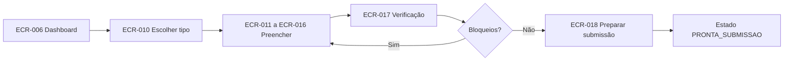
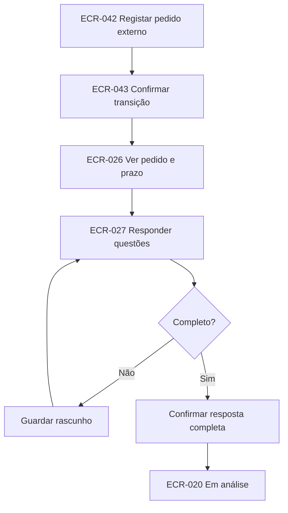

# Tópico 07 - Inventário de ecrãs e wireframes

## 1. Finalidade

Este documento identifica os ecrãs do MVP, os perfis autorizados, o objetivo de cada página e a ação principal. Os wireframes representam hierarquia e conteúdo, não cores, tipografia final ou código.

Os identificadores `ECR-*` serão usados em tarefas, testes e documentação para manter rastreabilidade entre planeamento e implementação.

## 2. Legenda de perfis

| Código | Perfil |
| --- | --- |
| `PUB` | Utilizador não autenticado |
| `CAN` | Candidato ou titular individual |
| `GER` | Gestor/RH dentro do âmbito autorizado |
| `ADM` | Administrador |

Uma página indicada para vários perfis adapta dados e ações ao âmbito de cada um.

## 3. Inventário geral

### 3.1. Acesso e área comum

| ID | Ecrã | Perfis | Objetivo | Ação principal |
| --- | --- | --- | --- | --- |
| `ECR-001` | Iniciar sessão | PUB | Autenticar por email e palavra-passe | `Iniciar sessão` |
| `ECR-002` | Pedir recuperação | PUB | Solicitar instruções sem revelar se a conta existe | `Enviar instruções` |
| `ECR-003` | Definir nova palavra-passe | PUB | Concluir recuperação através de token válido | `Guardar palavra-passe` |
| `ECR-004` | Acesso recusado | CAN, GER, ADM | Explicar genericamente que a operação não está disponível | `Voltar ao início` |
| `ECR-005` | Selecionar contexto | CAN, GER, ADM | Escolher área pessoal, empresa ou administração disponível | `Continuar neste contexto` |
| `ECR-006` | Dashboard | CAN, GER, ADM | Mostrar prioridades adaptadas ao contexto | Abrir a tarefa mais urgente |
| `ECR-007` | Centro de notificações | CAN, GER, ADM | Consultar avisos, ações e resolução | Abrir a ação relacionada |
| `ECR-008` | Perfil e segurança | CAN, GER, ADM | Rever contacto, sessão e dados permitidos | `Guardar alterações` |

### 3.2. Listas e criação de candidatura

| ID | Ecrã | Perfis | Objetivo | Ação principal |
| --- | --- | --- | --- | --- |
| `ECR-009` | Lista de candidaturas | CAN, GER, ADM | Pesquisar e filtrar processos visíveis | Abrir candidatura |
| `ECR-010` | Escolher tipo de candidatura | CAN, GER | Iniciar processo individual ou empresarial permitido | `Criar candidatura` |
| `ECR-011` | Passo 1 — tipo e titular | CAN, GER | Confirmar tipo, candidato ou empresa titular | `Guardar e continuar` |
| `ECR-012` | Passo 2 — dados de referência | CAN, GER | Confirmar perfil, empresa e situação profissional | `Guardar e continuar` |
| `ECR-013` | Passo 3 — beneficiários | GER; CAN em leitura do próprio | Incluir e validar pessoas abrangidas | `Adicionar beneficiário` |
| `ECR-014` | Passo 4 — formação | CAN, GER | Associar ações e componentes aos beneficiários | `Adicionar ação` |
| `ECR-015` | Passo 5 — custos e pagamento | CAN, GER | Registar custos, outros apoios e conta | `Guardar e continuar` |
| `ECR-016` | Passo 6 — documentos | CAN, GER | Cumprir a checklist de preparação | `Carregar documento` |
| `ECR-017` | Passo 7 — verificação | CAN, GER | Resolver bloqueios e reconhecer avisos | `Voltar ao primeiro bloqueio` |
| `ECR-018` | Passo 8 — preparar submissão | CAN, GER | Rever a fotografia que ficará pronta | `Validar candidatura` |
| `ECR-019` | Registar submissão externa | CAN, GER | Guardar o acontecimento ocorrido no Iefponline | `Confirmar submissão registada` |

### 3.3. Consulta e acompanhamento da candidatura

| ID | Ecrã | Perfis | Objetivo | Ação principal |
| --- | --- | --- | --- | --- |
| `ECR-020` | Resumo da candidatura | CAN, GER, ADM | Mostrar estado, próxima ação, prazos e bloqueios | Executar próxima ação |
| `ECR-021` | Beneficiários | CAN, GER, ADM | Comparar situação, formação e resultado por pessoa | Abrir beneficiário |
| `ECR-022` | Formação | CAN, GER, ADM | Consultar ações, componentes, frequência e resultado | Abrir ação |
| `ECR-023` | Elegibilidade | CAN, GER, ADM | Explicar verificações automáticas, manuais e externas | Resolver verificação pendente |
| `ECR-024` | Documentos | CAN, GER, ADM | Consultar checklist, versões e validações | Carregar ou validar documento |
| `ECR-025` | Histórico documental | CAN, GER, ADM | Ver versões sem perder a versão submetida | Descarregar versão autorizada |
| `ECR-026` | Pedidos adicionais | CAN, GER, ADM | Consultar pedidos, prazos e progresso | Abrir pedido pendente |
| `ECR-027` | Responder a pedido | CAN, GER | Responder questão a questão e anexar versões | `Registar resposta completa` |
| `ECR-028` | Termo de aceitação | CAN, GER, ADM | Acompanhar prazo, assinatura, ficheiro e validação | Carregar ou confirmar termo |
| `ECR-029` | Acompanhamento da formação | CAN, GER, ADM | Registar ou consultar execução real | Atualizar participação |
| `ECR-030` | Preparar encerramento | CAN, GER | Completar resultados e documentos finais | `Validar encerramento` |
| `ECR-031` | Registar encerramento externo | CAN, GER | Guardar submissão efetuada no Iefponline | `Confirmar pedido registado` |
| `ECR-032` | Prazos | CAN, GER, ADM | Consultar cálculo, data oficial e suspensões | Abrir obrigação relacionada |
| `ECR-033` | Financeiro | CAN, GER, ADM | Distinguir estimativas, aprovação, movimentos e saldo | Abrir detalhe do apoio |
| `ECR-034` | Histórico da candidatura | CAN, GER, ADM | Consultar linha temporal imutável | Abrir evidência autorizada |

### 3.4. Operação de Gestor/RH

| ID | Ecrã | Perfis | Objetivo | Ação principal |
| --- | --- | --- | --- | --- |
| `ECR-035` | Fila de trabalho | GER, ADM | Priorizar tarefas por prazo, estado e responsável | Assumir ou abrir tarefa |
| `ECR-036` | Empresas | GER, ADM | Consultar empresas no âmbito | Abrir empresa |
| `ECR-037` | Detalhe da empresa | GER, ADM | Consultar dados, trabalhadores e candidaturas | Criar candidatura empresarial |
| `ECR-038` | Associações da empresa | GER, ADM | Gerir acessos de Gestor/RH autorizados | Adicionar associação |
| `ECR-039` | Vínculos e trabalhadores | GER, ADM | Consultar histórico profissional aplicável | Adicionar vínculo |
| `ECR-040` | Formadoras e ações | GER, ADM | Pesquisar formadoras e ações existentes | Adicionar ação |
| `ECR-041` | Atribuições da candidatura | GER, ADM | Definir responsável e colaboradores | Alterar responsável |
| `ECR-042` | Registar acontecimento externo | GER, ADM | Escolher transição permitida e indicar evidência | Rever acontecimento |
| `ECR-043` | Confirmar transição | GER, ADM | Confirmar origem, data, efeito e estado novo | `Registar acontecimento` |
| `ECR-044` | Registar decisão por beneficiário | GER, ADM | Introduzir resultados e valores oficiais | Rever decisão |
| `ECR-045` | Validar documento | GER, ADM | Confirmar validade ou indicar correção necessária | `Guardar validação` |
| `ECR-046` | Registar movimento financeiro | GER, ADM | Guardar prestação, ajuste ou devolução oficial | `Confirmar movimento` |

### 3.5. Administração

| ID | Ecrã | Perfis | Objetivo | Ação principal |
| --- | --- | --- | --- | --- |
| `ECR-047` | Utilizadores | ADM | Pesquisar, ativar e desativar contas | Abrir utilizador |
| `ECR-048` | Utilizador e grupos | ADM | Gerir papéis globais e consultar associações | `Guardar grupos` |
| `ECR-049` | Conjuntos de regras | ADM | Consultar versões e vigências | Criar nova versão |
| `ECR-050` | Editar regras em rascunho | ADM | Configurar parâmetros antes da publicação | `Guardar rascunho` |
| `ECR-051` | Publicar conjunto de regras | ADM | Rever alterações e tornar versão imutável | `Publicar versão` |
| `ECR-052` | Feriados | ADM | Manter calendário usado em prazos | Adicionar feriado |
| `ECR-053` | Tipos documentais | ADM | Manter catálogo e sensibilidade | Adicionar tipo |
| `ECR-054` | Entidades formadoras | ADM | Gerir catálogo e certificações | Abrir formadora |
| `ECR-055` | Auditoria | ADM | Pesquisar eventos autorizados sem editar | Ver detalhe do evento |
| `ECR-056` | Estado técnico | ADM | Consultar saúde dos componentes sem segredos | Atualizar verificação |

O inventário contém 56 ecrãs lógicos. Alguns poderão partilhar template ou view, mas continuam separados quando representam objetivos, permissões ou confirmações diferentes.

## 4. Percursos principais

### FL-01 — Candidatura individual até ficar pronta



Pontos de teste:

- guardar e retomar cada passo;
- preservar dados quando uma validação falha;
- impedir titular ou beneficiário incoerente;
- distinguir aviso reconhecível de bloqueio;
- não marcar como submetida apenas por concluir o assistente.

### FL-02 — Registar submissão no portal externo

1. abrir `ECR-020` em `PRONTA_SUBMISSAO`;
2. escolher `Registar submissão no Iefponline`;
3. rever em `ECR-019` a versão pronta e documentos;
4. indicar data efetiva, declaração e referência quando exista;
5. confirmar;
6. regressar ao resumo em `SUBMETIDA`, com snapshot e histórico.

O texto confirma que o sistema apenas registou uma ação já realizada fora do Forma Flow.

### FL-03 — Candidatura empresarial com vários beneficiários

1. Gestor/RH seleciona a empresa no contexto;
2. cria candidatura empresarial;
3. adiciona trabalhadores dentro do vínculo e limite aplicáveis;
4. associa ações diferentes a cada beneficiário;
5. acompanha checklist por pessoa e ação;
6. revê estimativas separadas;
7. corrige bloqueios e valida a preparação.

A interface mantém sempre visível o beneficiário atual e exige confirmação antes de aplicar uma alteração a várias pessoas.

### FL-04 — Pedido de elementos



Pontos de teste:

- questões obrigatórias individualizadas;
- anexos pertencem à candidatura correta;
- rascunho não retoma prazo nem altera estado;
- confirmação lista as versões incluídas;
- repetição não duplica resposta ou transição.

### FL-05 — Decisão parcial

1. Gestor/RH abre `ECR-044` a partir de `EM_ANALISE`;
2. regista o resultado de cada beneficiário;
3. introduz data, origem, motivo aplicável e evidência;
4. revê o resultado global calculado;
5. confirma a transição;
6. o resumo apresenta estado administrativo e `DEFERIDA_PARCIAL` em dimensões separadas.

### FL-06 — Termo e acompanhamento

1. abrir cartão do termo em `APROVADA_AGUARDA_TERMO`;
2. consultar prazo e requisitos;
3. carregar a versão assinada;
4. Gestor/RH valida e regista a confirmação externa;
5. candidatura passa a acompanhamento;
6. atualizar execução real de cada participação.

### FL-07 — Encerramento

1. iniciar `ECR-030` quando as ações relevantes terminaram;
2. confirmar resultados, horas e custos;
3. reunir certificados e comprovativos finais;
4. rever valores finais e bloqueios;
5. validar preparação;
6. registar submissão externa em `ECR-031`;
7. acompanhar pedidos adicionais ou conclusão.

### FL-08 — Publicar regras

1. administrador cria nova versão a partir de uma versão existente;
2. edita apenas o rascunho;
3. consulta diferença de parâmetros e vigência;
4. resolve erros e sobreposições;
5. confirma em `ECR-051` que a publicação é imutável;
6. nova versão fica disponível para candidaturas aplicáveis sem alterar as antigas.

## 5. Wireframe — dashboard do candidato

```text
┌─────────────────────────────────────────────────────────────────────┐
│ Forma Flow                 Contexto: Área pessoal     Avisos (2)  ▾ │
├───────────────┬─────────────────────────────────────────────────────┤
│ Início        │ Início                                              │
│ Candidaturas  │                                                     │
│ Notificações  │ ┌─ Próxima ação ──────────────────────────────────┐ │
│ Perfil        │ │ Carregar comprovativo bancário                  │ │
│               │ │ Candidatura FF-2026-001 · até 08/09/2026       │ │
│               │ │ [Carregar documento]                            │ │
│               │ └────────────────────────────────────────────────┘ │
│               │                                                     │
│               │ A minha candidatura                                │
│               │ ┌───────────────────┬─────────────────────────────┐ │
│               │ │ Em análise       │ 6 de 8 documentos válidos  │ │
│               │ │ Registo externo  │ Próximo prazo: 8 dias       │ │
│               │ │ [Abrir resumo]   │ [Ver checklist]             │ │
│               │ └───────────────────┴─────────────────────────────┘ │
│               │                                                     │
│               │ Notificações recentes                              │
│               │ • Documento inválido — Corrigir                    │
│               │ • Estado alterado para “Em análise” — Consultar    │
└───────────────┴─────────────────────────────────────────────────────┘
```

Em telemóvel, a navegação passa para menu e os cartões ficam numa coluna. A próxima ação permanece antes dos resumos.

## 6. Wireframe — dashboard do Gestor/RH

```text
┌──────────────────────────────────────────────────────────────────────┐
│ Forma Flow       Contexto: Empresa Exemplo, Lda.      Avisos (7)  ▾ │
├────────────────┬─────────────────────────────────────────────────────┤
│ Dashboard      │ Dashboard                                           │
│ Candidaturas   │ [Pesquisar referência ou nome] [Estado ▾] [Filtrar]│
│ Empresas       │                                                     │
│ Formação       │ ┌────────┐ ┌────────┐ ┌────────┐ ┌────────┐        │
│ Notificações   │ │ 3      │ │ 5      │ │ 2      │ │ 1      │        │
│                │ │Urgentes│ │Aguardar│ │Docs.   │ │Vencido │        │
│                │ │        │ │element.│ │invál.  │ │        │        │
│                │ └────────┘ └────────┘ └────────┘ └────────┘        │
│                │                                                     │
│                │ Prioridades                                         │
│                │ ┌────┬───────────┬────────────┬──────────┬────────┐ │
│                │ │ !  │ Referência│ Próxima ação│ Prazo    │ Ação  │ │
│                │ ├────┼───────────┼────────────┼──────────┼────────┤ │
│                │ │Alta│ FF-...001 │ Responder   │ Hoje     │ Abrir  │ │
│                │ │Alta│ FF-...014 │ Validar doc.│ Amanhã   │ Abrir  │ │
│                │ └────┴───────────┴────────────┴──────────┴────────┘ │
│                │ [Ver toda a fila de trabalho]                       │
└────────────────┴─────────────────────────────────────────────────────┘
```

Os cartões são ligações para listas já filtradas. Os números contam apenas objetos autorizados naquele contexto.

## 7. Wireframe — resumo da candidatura

```text
┌──────────────────────────────────────────────────────────────────────┐
│ Candidaturas / FF-2026-001                                          │
│ Candidatura individual                      Estado: Em análise       │
│ Registo externo · Atualizado em 02/09/2026 às 14:30                  │
│                                            [Registar acontecimento ▾]│
├──────────────────────────────────────────────────────────────────────┤
│ Resumo | Beneficiários | Formação | Documentos | Pedidos | ...      │
├──────────────────────────────────────────────────────────────────────┤
│ ┌─ Próxima ação ─────────────────────┐ ┌─ Prazo principal ────────┐ │
│ │ Responder ao pedido de elementos   │ │ 8 dias úteis restantes  │ │
│ │ Responsável: Gestor Exemplo        │ │ Limite: 14/09/2026      │ │
│ │ [Abrir pedido]                     │ │ Estado: suspenso         │ │
│ └────────────────────────────────────┘ └───────────────────────────┘ │
│                                                                      │
│ Progresso                                                            │
│ Dados ✓  Beneficiários ✓  Formação ✓  Documentos 6/8  Verificação ! │
│                                                                      │
│ Bloqueios e avisos                                                   │
│ [Erro] Comprovativo de IBAN inválido                  [Substituir]   │
│ [Aviso] Certificação da formadora aguarda confirmação [Consultar]   │
│                                                                      │
│ Resultados e valores                                                 │
│ Decisão: Pendente     Estimativa do Forma Flow: 175,00 €            │
└──────────────────────────────────────────────────────────────────────┘
```

O estado administrativo, o pedido, o prazo e a estimativa mantêm rótulos próprios.

## 8. Wireframe — assistente da candidatura

```text
┌───────────────────────────────────────────────────────────────────┐
│ Nova candidatura · Rascunho                                      │
│                                                                   │
│ 1 Tipo ✓ — 2 Dados ✓ — 3 Beneficiários — 4 Formação — 5 Custos  │
│ 6 Documentos — 7 Verificação — 8 Preparar                         │
├───────────────────────────────────────────────────────────────────┤
│ Passo 3 de 8 · Beneficiários                                     │
│ Inclua os trabalhadores abrangidos por esta candidatura.         │
│ Limite desta versão de regras: 20.                               │
│                                                                   │
│ ┌───────────────────────────────────────────────────────────────┐ │
│ │ Pessoa fictícia A · vínculo confirmado     [Editar] [Remover]│ │
│ │ Formação ainda não associada                                  │ │
│ └───────────────────────────────────────────────────────────────┘ │
│                                                                   │
│ [Adicionar beneficiário]                                         │
│                                                                   │
│ [Guardar rascunho]                  [Guardar e continuar]         │
└───────────────────────────────────────────────────────────────────┘
```

Remover um beneficiário com dados dependentes abre uma página de confirmação que lista as consequências permitidas no estado de rascunho.

## 9. Wireframe — checklist documental

```text
┌────────────────────────────────────────────────────────────────────┐
│ Documentos · FF-2026-001                       6 de 8 válidos       │
│ [Estado ▾] [Fase ▾] [Beneficiário ▾] [Tipo ▾] [Limpar filtros]    │
├────────────────────────────────────────────────────────────────────┤
│ [Em falta · Bloqueante] Comprovativo de titularidade bancária     │
│ Titular · Preparação · PDF até 2 MB                               │
│ Motivo: necessário para indicar a conta de pagamento              │
│                                             [Carregar documento]   │
├────────────────────────────────────────────────────────────────────┤
│ [Inválido · Bloqueante] Declaração da entidade formadora          │
│ Formação A · Versão 2 · validada em 01/09/2026                    │
│ Correção: falta identificar o código da componente CNQ            │
│                         [Ver histórico] [Carregar nova versão]     │
├────────────────────────────────────────────────────────────────────┤
│ [Válido] Certificado da formação                                  │
│ Pessoa fictícia A · Encerramento · Versão 1                       │
│                                      [Ver detalhe] [Descarregar]   │
└────────────────────────────────────────────────────────────────────┘
```

Estado, bloqueio, pessoa, fase e ação são legíveis sem depender da cor.

## 10. Wireframe — resposta a pedido

```text
┌────────────────────────────────────────────────────────────────────┐
│ Pedido de elementos · Análise                     Faltam 4 dias    │
│ Recebido em 02/09/2026 · Prazo suspenso                         │
│ Progresso: 1 de 2 questões completas                             │
├────────────────────────────────────────────────────────────────────┤
│ Questão 1 · Obrigatória                              [Completa]    │
│ “Apresente a justificação da componente extra-CNQ.”               │
│ Resposta: [texto guardado.......................................]  │
│ Anexo: justificacao-v1.pdf                         [Substituir]    │
├────────────────────────────────────────────────────────────────────┤
│ Questão 2 · Obrigatória                              [Em falta]    │
│ “Envie declaração atualizada da entidade formadora.”              │
│ Resposta: [......................................................] │
│ [Carregar documento]                                               │
├────────────────────────────────────────────────────────────────────┤
│ [Guardar rascunho]                                                 │
│ Registar resposta completa — indisponível: falta a questão 2       │
└────────────────────────────────────────────────────────────────────┘
```

O motivo da indisponibilidade é texto visível e conduz ao primeiro requisito em falta.

## 11. Wireframe — confirmação de acontecimento externo

```text
┌────────────────────────────────────────────────────────────────────┐
│ Confirmar registo de acontecimento                                 │
│ Esta operação guarda um acontecimento comunicado externamente.     │
├────────────────────────────────────────────────────────────────────┤
│ Candidatura: FF-2026-001                                           │
│ Acontecimento: Parecer favorável                                   │
│ Estado atual: Em análise                                           │
│ Novo estado: Aprovada — aguarda termo                              │
│ Data efetiva: 02/09/2026 10:15                                    │
│ Origem: Comunicação do IEFP                                        │
│ Evidência: decisao-v1.pdf                                          │
│ Resultado: Deferida parcial — 2 de 3 beneficiários                 │
│                                                                    │
│ Efeitos: criar prazo do termo, tarefas e notificações.             │
│                                                                    │
│ [Voltar e corrigir]                     [Registar acontecimento]    │
└────────────────────────────────────────────────────────────────────┘
```

A confirmação não usa linguagem que sugira que o Forma Flow tomou a decisão.

## 12. Especificação de páginas críticas

### 12.1. `ECR-006` — Dashboard

Dados necessários:

- contexto atual;
- tarefas abertas ordenadas por urgência;
- candidaturas recentes e ativas;
- prazos nos limiares aplicáveis;
- documentos com ação pendente;
- contagem de notificações não lidas.

Estados obrigatórios:

- sem candidaturas;
- sem tarefas pendentes;
- contexto sem acesso ativo;
- falha temporária de uma métrica sem perder toda a página.

Testes principais:

- isolamento por empresa e atribuição;
- números iguais às listas filtradas;
- ordem de prioridade determinística;
- navegação por teclado.

### 12.2. `ECR-018` — Preparar submissão

Dados necessários:

- titular e versão de regras;
- beneficiários e ações;
- checklist por estado;
- verificações bloqueantes e avisos reconhecidos;
- estimativas claramente identificadas;
- declarações exigidas.

Regras:

- não existe botão de submissão direta ao IEFP;
- bloqueios conduzem ao local de correção;
- avisos exigem reconhecimento explícito quando definido;
- confirmar cria apenas o estado `PRONTA_SUBMISSAO`;
- editar dado relevante depois desta validação regressa a rascunho.

### 12.3. `ECR-019` — Registar submissão externa

Dados de entrada:

- data e hora efetivas;
- referência externa opcional conforme disponibilidade;
- confirmação de que a operação ocorreu no Iefponline;
- observação e evidência quando exigidas.

Resultado:

- snapshot imutável;
- transição `TR-004`;
- estado `SUBMETIDA`;
- prazo de decisão;
- histórico, tarefas e notificações sem duplicação.

### 12.4. `ECR-024` — Documentos

Consultas necessárias:

- requisitos agrupados por fase e pessoa;
- versão corrente carregada em lote, sem consulta por linha;
- contagens por estado;
- filtros preservados no URL;
- ações calculadas conforme estado e permissão.

O histórico de versões fica numa página separada para reduzir ruído sem o esconder.

### 12.5. `ECR-043` — Confirmar transição

Antes de permitir confirmação deve apresentar:

- objeto e âmbito;
- código e nome da transição;
- estado anterior e novo;
- data efetiva diferente da data de registo, quando aplicável;
- origem e referência;
- evidência;
- efeitos secundários;
- motivo obrigatório para exceções;
- aviso de conflito se a versão já mudou.

### 12.6. `ECR-051` — Publicar regras

Deve mostrar:

- versão anterior e nova;
- período de vigência;
- parâmetros adicionados, alterados e removidos;
- candidaturas futuras potencialmente abrangidas;
- erros de sobreposição;
- confirmação de que a versão ficará imutável.

Publicar nunca recalcula candidaturas já submetidas.

## 13. Componentes e reutilização por ecrã

| Componente | Ecrãs principais |
| --- | --- |
| Seletor de contexto | `ECR-005`, cabeçalho autenticado |
| Cartão de próxima ação | `ECR-006`, `ECR-020` |
| Indicador de prazo | `ECR-006`, `ECR-020`, `ECR-026`, `ECR-028`, `ECR-032` |
| Tabela filtrável | `ECR-009`, `ECR-021`, `ECR-024`, `ECR-035`, `ECR-047`, `ECR-055` |
| Assistente de passos | `ECR-011` a `ECR-018`, `ECR-030` |
| Checklist | `ECR-016`, `ECR-024`, `ECR-030` |
| Histórico de versões | `ECR-025`, `ECR-027`, `ECR-028` |
| Linha temporal | `ECR-034` |
| Resumo de confirmação | `ECR-019`, `ECR-031`, `ECR-043`, `ECR-044`, `ECR-046`, `ECR-051` |
| Explicação de cálculo | `ECR-017`, `ECR-033` |
| Resumo de erros | Todos os formulários |
| Estado vazio | Todas as listas e dashboards |

Um componente partilhado mantém apresentação e acessibilidade, mas recebe permissões e ações já calculadas pelo servidor.

## 14. Matriz de estados especiais

| Ecrã | Vazio | Erro de validação | Sem permissão | Conflito | Operação concluída |
| --- | --- | --- | --- | --- | --- |
| Dashboard | Sem candidaturas ou tarefas | Não aplicável | Contexto indisponível | Dados atualizados durante ação | Mensagem e métricas atualizadas |
| Assistente | Primeiro item por criar | Resumo e campos | Candidatura fora do âmbito | Versão alterada | Passo marcado e hora guardada |
| Documentos | Nenhum requisito aplicável | Ficheiro e metadados | Download recusado genericamente | Versão corrente mudou | Nova versão e estado |
| Pedido | Sem pedidos recebidos | Questão incompleta | Pedido fora do âmbito | Outra resposta foi submetida | Snapshot e regresso à análise |
| Financeiro | Ainda sem apoio | Montante ou origem inválida | Valores ocultos | Movimento já registado | Total e histórico atualizados |
| Regras | Sem versão em rascunho | Parâmetro ou vigência | Apenas administrador | Versão já publicada | Nova versão imutável |

## 15. Critérios de aceitação visual por ecrã

Antes de considerar um ecrã implementado:

- [ ] tem um único título principal;
- [ ] breadcrumb e item de navegação atual estão corretos;
- [ ] ação principal é inequívoca;
- [ ] ações indisponíveis têm motivo;
- [ ] todos os estados previstos foram tratados;
- [ ] erros preservam dados válidos;
- [ ] dados sensíveis estão mascarados;
- [ ] o âmbito foi testado por URL direta;
- [ ] funciona a 320, 768 e 1280 píxeis de largura;
- [ ] funciona apenas com teclado;
- [ ] foco e mensagens são percetíveis;
- [ ] contraste e significado sem cor foram verificados;
- [ ] dados longos e listas vazias não quebram o layout;
- [ ] datas, moeda e linguagem usam português de Portugal;
- [ ] testes de view e permissões cobrem a ação principal.

## 16. Prioridade de implementação dos ecrãs

### Grupo UI-0 — Base visual e acesso

`ECR-001` a `ECR-008`, layout, navegação, mensagens, campos e estados vazios.

### Grupo UI-1 — Preparação da candidatura

`ECR-009` a `ECR-020`, assistente, progresso, verificação e registo externo.

### Grupo UI-2 — Documentos e análise

`ECR-021` a `ECR-028`, checklist, versões, pedidos e termo.

### Grupo UI-3 — Acompanhamento e finanças

`ECR-029` a `ECR-034`, execução da formação, encerramento, prazos e valores.

### Grupo UI-4 — Operação Gestor/RH

`ECR-035` a `ECR-046`, filas, empresas, atribuições e acontecimentos oficiais.

### Grupo UI-5 — Administração

`ECR-047` a `ECR-056`, utilizadores, regras, catálogos, auditoria e saúde.

Cada grupo será integrado nos incrementos `IMP-*` correspondentes do Tópico 6. Não será criada uma fase tardia separada para “adicionar acessibilidade”; os critérios aplicam-se desde `UI-0`.

## 17. Questões que permanecem para validação visual

Antes de implementar o sistema visual final será necessário decidir:

- logótipo e assinatura visual do Forma Flow;
- família tipográfica disponível e licenciada;
- valores exatos da paleta após testes de contraste;
- conjunto de ícones e modo de utilização acessível;
- densidade das tabelas para a demonstração;
- necessidade de modo escuro, que não é requisito do MVP;
- aparência de gráficos, caso os dados justifiquem a sua inclusão.

Estas decisões não alteram os percursos, estados nem permissões definidos neste documento.

## 18. Resultado

Os 56 ecrãs lógicos, oito percursos principais, componentes partilhados, estados especiais e critérios de aceitação estão definidos. A implementação poderá seguir os grupos `UI-0` a `UI-5` sem confundir decisões oficiais, estimativas, estados e ações de cada perfil.
