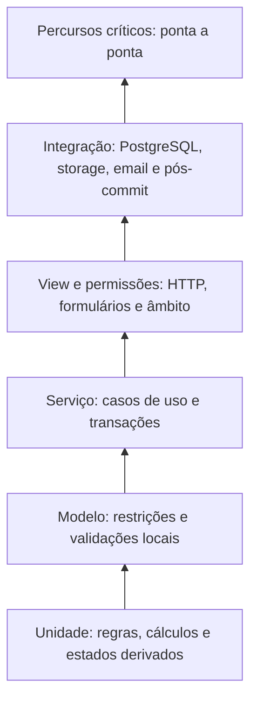
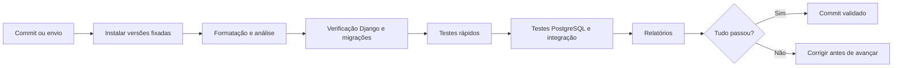

# Tópico 08 - Testes, validação e demonstração

## 1. Objetivo e estado

Este documento define como será demonstrado que o Forma Flow cumpre o âmbito, as permissões, as regras, o workflow, o modelo de dados e a experiência planeados. Estabelece níveis de teste, ambientes, dados, rastreabilidade, segurança, acessibilidade, desempenho, critérios de entrada e saída e preparação da demonstração.

O detalhe dos cenários encontra-se no [catálogo de casos de teste](08-catalogo-casos-teste.md).

O Tópico 8 é uma extensão de planeamento. Não cria testes Python, fixtures, base de dados, pipeline ou código da aplicação.

## 2. Objetivos de qualidade

O sistema só será considerado pronto quando existir evidência de que:

1. as regras implementadas produzem resultados corretos nos limites;
2. uma pessoa nunca consulta ou altera dados fora do seu âmbito;
3. as 23 transições respeitam origem, papel, condições e efeitos;
4. operações repetidas não criam submissões, movimentos ou avisos duplicados;
5. documentos privados permanecem privados e versionados;
6. estimativas não são apresentadas como decisões oficiais;
7. falhas não deixam estados ou ficheiros parcialmente válidos;
8. os percursos principais funcionam com teclado e em ecrãs estreitos;
9. uma instalação limpa consegue reproduzir o resultado;
10. a demonstração utiliza apenas dados fictícios e continua possível sem serviços externos.

## 3. Princípios de teste

### 3.1. Testar comportamento observável

Os testes verificam entradas, resultados, permissões, efeitos persistidos e mensagens relevantes. Não ficam acoplados a detalhes internos que possam mudar sem alterar o comportamento.

### 3.2. Risco antes da percentagem

Transições, permissões, documentos e dinheiro recebem mais profundidade do que páginas estáticas. Cobertura de linhas será medida, mas uma percentagem elevada não substitui cenários de risco.

### 3.3. Cada defeito permanente ganha um teste

Quando um erro for corrigido, cria-se primeiro ou no mesmo commit um teste que falhe com o comportamento anterior e passe com a correção. O objetivo é impedir regressão, não apenas provar a correção manual.

### 3.4. Determinismo

- tempo e data são controláveis nos testes;
- feriados e parâmetros vêm de dados explícitos;
- ordem de resultados tem critério definido;
- email, storage e integrações usam substitutos controlados;
- testes não dependem da Internet;
- cada teste cria os dados de que necessita ou usa uma fábrica conhecida.

### 3.5. Base de dados representativa

Testes de restrições, transações, concorrência e consultas usam PostgreSQL. SQLite não será usado como prova desses comportamentos.

### 3.6. Testes independentes

Um teste pode correr isolado, em qualquer ordem e repetidamente. Não depende de registos deixados por outro teste nem de ficheiros permanentes no computador.

## 4. Âmbito

### 4.1. Incluído

- autenticação, sessão e recuperação de acesso;
- papéis globais e âmbitos de candidato, empresa e candidatura;
- 72 regras de negócio `RN-*`;
- 23 transições `TR-*`;
- restrições das 38 entidades;
- formulários, views e 56 ecrãs lógicos `ECR-*`;
- uploads, versões, snapshots e downloads;
- prazos, suspensões, tarefas e notificações;
- estimativas, valores oficiais, movimentos e restituições;
- acessibilidade, segurança, desempenho básico e instalação;
- oito percursos `FL-*` e cenários de demonstração.

### 4.2. Fora do âmbito inicial

- testes a integrações reais com IEFP, Iefponline, DGERT, SIGO ou entidades públicas;
- testes de aplicação móvel nativa;
- carga de produção em larga escala ainda desconhecida;
- certificação formal externa de segurança ou acessibilidade;
- processamento de dados pessoais reais;
- disponibilidade contínua de infraestrutura que ainda não foi escolhida.

Estes limites não permitem afirmar conformidade ou segurança absoluta; permitem validar o MVP académico definido.

## 5. Modelo de teste



A base terá muitos testes rápidos. Percursos completos serão menos numerosos, mas cobrirão os resultados essenciais da PAP.

## 6. Níveis e responsabilidades

| Nível | Unidade testada | Dependências reais | Responsabilidade principal |
| --- | --- | --- | --- |
| Unidade | Função ou regra pura | Nenhuma | Cálculos, calendário, escolhas e derivações |
| Modelo | Entidade e restrição | PostgreSQL quando necessário | Integridade local e unicidade |
| Serviço | Caso de uso | PostgreSQL; adaptadores substituídos | Permissão, transação, histórico e efeitos |
| View | Pedido e resposta HTTP | Aplicação de teste | Formulário, estado HTTP, redirect e mensagem |
| Integração | Fronteira técnica | PostgreSQL, storage temporário, email de teste | Comportamento entre componentes |
| Percurso | Sequência do utilizador | Sistema completo local | Valor demonstrável de ponta a ponta |
| Manual | Interface renderizada | Navegador e tecnologia de apoio | Usabilidade, acessibilidade e conteúdo |

## 7. Ambientes

### 7.1. Local

- execução rápida durante desenvolvimento;
- PostgreSQL de desenvolvimento separado;
- storage privado local ignorado pelo Git;
- email em consola;
- dados exclusivamente fictícios.

### 7.2. Automatizado

- base PostgreSQL descartável;
- configuração `test`;
- storage temporário por execução;
- relógio e adaptadores controlados;
- nenhum acesso de rede necessário;
- relatório de falhas e cobertura preservado quando útil.

### 7.3. Demonstração

- versão marcada por commit;
- base preparada por comando repetível;
- contas e cenários fictícios;
- email e integrações em modo seguro;
- plano alternativo local;
- dados restauráveis para repetir a apresentação.

### 7.4. Pré-publicação futura

- configuração semelhante ao ambiente final;
- segredos próprios e não reutilizados;
- teste de migração, backup e restauro;
- verificação de HTTPS, cookies, headers e ficheiros privados;
- varrimento de segurança e acessibilidade;
- testes de fumo depois da publicação.

## 8. Dados de teste

### 8.1. Regras

Os testes nunca usam implicitamente “a regra atual”. Cada cenário indica:

- código e versão de `ConjuntoRegras`;
- parâmetros relevantes;
- data de referência;
- calendário e feriados;
- condição de demonstração ou confirmação oficial.

### 8.2. Pessoas e organizações

Serão criadas personas fictícias estáveis:

- candidato A e candidato B sem relação entre si;
- gestor A associado apenas à empresa A;
- gestor B associado apenas à empresa B;
- administrador;
- utilizador inativo;
- entidade formadora certificada;
- entidade formadora dispensada;
- entidade pendente de confirmação.

NIF, NIPC, IBAN, emails e documentos serão sintéticos e claramente reservados ao teste.

### 8.3. Candidaturas de referência

- individual em rascunho;
- individual pronta para submissão;
- individual em análise com pedido adicional;
- empresarial com três beneficiários e formações diferentes;
- empresarial com decisão parcial;
- aprovada a aguardar termo;
- em acompanhamento;
- encerramento em preparação;
- concluída a aguardar pagamento;
- estado terminal desfavorável;
- prazo urgente, suspenso e vencido;
- documento válido, inválido e substituído.

### 8.4. Ficheiros

O conjunto inclui:

- PDF válido abaixo do limite;
- PDF exatamente no limite;
- PDF acima do limite;
- extensão `.pdf` com conteúdo incompatível;
- ficheiro vazio;
- conteúdo repetido com nome diferente;
- nome com caracteres especiais e tentativa de caminho;
- versão marcada como suspeita ou bloqueada;
- documento fictício com validade passada.

Nenhum ficheiro contém dados pessoais reais.

## 9. Rastreabilidade

### 9.1. Identificadores

| Origem | Quantidade | Evidência futura |
| --- | ---: | --- |
| Objetivos e critérios do Tópico 1 | Conforme secções | Percursos `CT-E2E-*` |
| Papéis e permissões do Tópico 2 | Matriz completa | Casos `CT-PRM-*` |
| Regras `RN-*` do Tópico 3 | 72 | Teste ou vetor identificado pelo mesmo código |
| Transições `TR-*` do Tópico 4 | 23 | Matriz parametrizada e casos `CT-WFL-*` |
| Entidades do Tópico 5 | 38 | Testes de modelo, serviço e migração |
| Incrementos `IMP-*` do Tópico 6 | 10 | Critério de saída de cada incremento |
| Ecrãs `ECR-*` do Tópico 7 | 56 | Teste de view e checklist visual |
| Percursos `FL-*` do Tópico 7 | 8 | Casos `CT-E2E-*` |

### 9.2. Regra de cobertura

Nenhum código `RN-*`, `TR-*`, `ECR-*` ou `FL-*` será marcado como implementado sem apontar para pelo menos uma prova. Um único teste pode provar vários requisitos, mas a matriz regista todas as relações.

### 9.3. Nome dos testes futuros

Os nomes deverão explicar condição e resultado, por exemplo:

```text
test_tr_004_recusa_quando_existem_documentos_bloqueantes
test_rn_fin_002_limita_apoio_a_percentagem_do_custo
test_gestor_empresa_a_nao_consulta_candidatura_empresa_b
```

Estes exemplos são convenções de planeamento, não ficheiros de código.

## 10. Estratégia para as 72 regras

Cada regra terá pelo menos:

- caso favorável;
- caso desfavorável;
- valor imediatamente abaixo do limite, quando exista;
- valor exatamente no limite;
- valor imediatamente acima;
- valor desconhecido ou nulo;
- versão de regras aplicável;
- confirmação de que o resultado interno não se torna decisão oficial.

Regras documentais acrescentam combinação de condições. Regras de data acrescentam mudança de mês, ano bissexto, fim de semana, feriado e suspensão. Regras financeiras usam `Decimal` e confirmam arredondamento apenas no momento definido.

## 11. Estratégia para as 23 transições

Uma matriz parametrizada cobrirá para cada `TR-*`:

1. estado de origem válido;
2. estados de origem recusados;
3. papéis autorizados e recusados;
4. âmbito correto e incorreto;
5. pré-condições presentes e ausentes;
6. estado de destino;
7. incremento de versão;
8. histórico criado;
9. tarefas, prazos, snapshots ou notificações esperados;
10. idempotência;
11. rollback integral perante falha;
12. data efetiva e data de registo preservadas.

`TR-023` terá casos adicionais para correção por administrador, ligação à transição incorreta e preservação do histórico original.

## 12. Permissões

### 12.1. Método

Cada operação sensível é testada com:

- utilizador correto;
- utilizador autenticado sem papel;
- candidato diferente;
- gestor de outra empresa;
- gestor da empresa sem atribuição quando necessária;
- associação expirada;
- utilizador inativo;
- pedido anónimo;
- administrador quando autorizado;
- acesso direto pelo URL ou `public_id`.

### 12.2. Resposta segura

O teste verifica não apenas o código HTTP, mas também que:

- o conteúdo não revela nome, estado ou existência do objeto alheio;
- o objeto não foi modificado;
- não houve download ou URL temporário emitido;
- a tentativa foi auditada quando definido;
- listas, contagens e exportações aplicam o mesmo âmbito.

## 13. Documentos e storage

Devem ser testados:

- tamanho, extensão, MIME e assinatura real;
- sanitização de nome e chave aleatória;
- zona privada e ausência de URL pública;
- autorização repetida no download;
- hash e metadados;
- análise pendente, segura, suspeita e bloqueada;
- criação atómica da versão;
- uma única versão corrente;
- substituição e preservação histórica;
- snapshot com versões exatas;
- limpeza segura de temporários órfãos;
- indisponibilidade do storage sem alterar o estado documental.

## 14. Finanças

### 14.1. Precisão

- usar valores decimais exatos;
- testar zero, máximo, limite percentual e custo inferior ao apoio máximo;
- separar custo declarado, elegível, estimado, aprovado, final e pago;
- testar financiamento por terceiros;
- reproduzir a decomposição do cálculo;
- manter versão de regras e parâmetros.

### 14.2. Movimentos

- créditos e débitos afetam o saldo na direção correta;
- só movimentos confirmados contam como pagos;
- repetir chave de idempotência não duplica valor;
- cancelado e falhado não contam como efetivos;
- restituição só nasce de registo oficial;
- valor desconhecido permanece nulo.

## 15. Acessibilidade e usabilidade

### 15.1. Avaliação contínua

A acessibilidade é verificada em cada grupo `UI-*`, não apenas no fim. O processo combina ferramentas automáticas e avaliação humana, porque uma ferramenta isolada não consegue determinar conformidade.

### 15.2. Amostra obrigatória

Inclui pelo menos:

- login e recuperação;
- dashboard de cada perfil;
- assistente de candidatura;
- checklist e upload;
- resposta a pedido;
- confirmação de acontecimento externo;
- financeiro;
- configuração de regras.

### 15.3. Verificações manuais

- sequência completa com teclado;
- foco visível e não oculto;
- título, landmarks e ordem de cabeçalhos;
- etiquetas, instruções e erros de formulário;
- ampliação e largura de 320 píxeis CSS;
- contraste e significado sem cor;
- mensagens dinâmicas;
- leitor de ecrã disponível no Windows;
- colar e gestor de palavras-passe no login;
- alvos de interação e espaçamento;
- conteúdo em português de Portugal.

### 15.4. Usabilidade

Uma pessoa externa à implementação executará os sete exercícios do Tópico 7. Registam-se sucesso, hesitações, erro recuperável, pedido de ajuda e observações. Não se recolhem dados pessoais do participante além do necessário para a atividade académica.

## 16. Segurança

### 16.1. Referência

O projeto usa categorias do OWASP ASVS 5.0.0 e do Web Security Testing Guide estável como orientação. Isto não constitui certificação ASVS nem teste de intrusão profissional.

### 16.2. Áreas mínimas

- autenticação, recuperação e gestão de sessão;
- autorização por objeto e empresa;
- validação e codificação de entradas e saídas;
- CSRF e métodos HTTP;
- uploads e downloads;
- mensagens de erro;
- segredos e configuração;
- dados sensíveis e logs;
- dependências conhecidas;
- HTTPS e cookies no ambiente publicado;
- exportações e administração;
- prevenção de injeção através do ORM e validação de qualquer SQL excecional.

### 16.3. Limites

Testes destrutivos ou de carga contra serviços públicos exigem autorização e ambiente próprio. Nunca serão executados contra sistemas do IEFP ou terceiros.

## 17. Desempenho e consultas

### 17.1. Conjunto de referência

Será gerado um volume fictício suficiente para revelar consultas repetidas:

- 1 000 candidaturas;
- até 20 beneficiários numa candidatura empresarial;
- várias formações, requisitos, versões, transições e notificações por processo;
- tarefas e prazos distribuídos por estados e responsáveis.

### 17.2. Medidas

- número de consultas das listas e dashboards;
- tempo de resposta local com ambiente identificado;
- tempo do comando de alertas;
- memória durante exportações permitidas;
- tamanho e paginação das respostas;
- consulta dos índices previstos no Tópico 5.

### 17.3. Critério

Primeiro será registada uma linha de base no equipamento de desenvolvimento. Uma alteração que aumente consultas por linha ou degrade de forma repetível mais de 20% sem justificação bloqueia o incremento. Limites absolutos só serão fixados depois da primeira medição representativa.

## 18. Compatibilidade

Os percursos críticos serão verificados nas versões estáveis suportadas disponíveis de:

- Microsoft Edge no Windows, navegador principal da demonstração;
- Google Chrome;
- Firefox;
- viewport de telemóvel através das ferramentas do navegador e, quando disponível, aparelho real.

Não é necessário suportar navegadores sem atualizações de segurança. Qualquer limitação conhecida será documentada.

## 19. Integração contínua



Portões planeados:

1. formatação consistente;
2. análise estática sem erro bloqueante;
3. configuração Django válida;
4. nenhuma migração esquecida;
5. migrações aplicáveis numa base vazia;
6. testes automatizados aprovados;
7. relatório de cobertura disponível;
8. dependências e segredos verificados;
9. documentação atualizada quando o comportamento muda.

Testes lentos ou manuais podem correr numa fase separada, mas nunca substituem os portões rápidos.

## 20. Classificação de defeitos

| Severidade | Definição | Exemplos | Regra de saída |
| --- | --- | --- | --- |
| `S1 Crítica` | Perda, exposição ou corrupção grave; fluxo principal impossível | Acesso a documento alheio, pagamento duplicado, migração destrutiva | Zero abertas |
| `S2 Alta` | Regra central incorreta ou função principal sem alternativa | Transição inválida, cálculo errado, submissão sem snapshot | Zero abertas |
| `S3 Média` | Função secundária incorreta com alternativa segura | Filtro perde seleção, mensagem pouco específica | Corrigir ou aceitar com justificação |
| `S4 Baixa` | Problema cosmético ou melhoria | Espaçamento, texto não crítico | Pode entrar no backlog |

Um defeito inclui: ambiente, versão/commit, precondições, passos, resultado esperado, resultado observado, evidência e severidade.

## 21. Ciclo de um caso de teste

Estados previstos:

- `PLANEADO`;
- `PRONTO`;
- `EM_EXECUCAO`;
- `APROVADO`;
- `FALHOU`;
- `BLOQUEADO`;
- `NAO_APLICAVEL` com justificação.

Um caso falhado cria ou liga um defeito. Depois da correção, executa-se o caso, o teste de regressão e os percursos potencialmente afetados.

## 22. Evidência

Para cada execução relevante serão guardados no repositório ou artefacto da execução:

- commit testado;
- ambiente e versões;
- conjunto de casos;
- resultado e duração;
- logs sanitizados;
- capturas apenas quando acrescentam valor e sem dados reais;
- defeitos associados;
- responsável e data.

Não se enviam bases de dados, `.env`, chaves, uploads privados ou relatórios com dados sensíveis.

## 23. Critérios por incremento

Um incremento `IMP-*` só termina quando:

- código e migrações correspondem ao planeado;
- testes novos passam isoladamente e no conjunto;
- permissões negativas estão cobertas;
- defeitos S1 e S2 estão resolvidos;
- documentação afetada foi atualizada;
- execução limpa foi confirmada;
- commit foi revisto e enviado ao GitHub.

Se o incremento ainda não tem interface, os casos `ECR-*` correspondentes permanecem planeados, não falsamente aprovados.

## 24. Critérios de entrada para validação final

- `IMP-00` a `IMP-09` concluídos ou desvios aprovados;
- migrações aplicadas numa base vazia;
- dados fictícios repetíveis disponíveis;
- todos os casos críticos prontos;
- ambiente de demonstração identificado;
- documentação de instalação atualizada;
- nenhuma integração externa obrigatória para o percurso principal.

## 25. Critérios de saída do MVP

- todos os `RN-*` implementados no MVP têm prova associada;
- todas as 23 transições passam a matriz permitida e recusada;
- todos os 56 ecrãs implementados têm teste de acesso e checklist visual;
- os oito percursos `FL-*` passam;
- zero defeitos S1 ou S2 abertos;
- permissões por objeto passam nos cenários negativos;
- backups e restauro foram ensaiados quando existir ambiente persistente;
- instalação limpa e demonstração foram repetidas;
- limitações e regras ainda de referência estão explícitas;
- documentação final corresponde ao commit apresentado.

## 26. Plano de demonstração

### 26.1. Preparação

- fixar o commit;
- recriar dados fictícios;
- executar testes de fumo;
- confirmar contas e contextos;
- preparar PDFs fictícios válidos e inválidos;
- verificar resolução, navegador e zoom;
- ensaiar sem Internet;
- manter cópia recuperável do ambiente local.

### 26.2. Percurso principal sugerido

1. entrar como Gestor/RH;
2. mostrar dashboard e isolamento por empresa;
3. abrir candidatura empresarial com vários beneficiários;
4. mostrar checklist e substituição de documento;
5. registar pedido de elementos e responder;
6. mostrar suspensão e retoma do prazo;
7. registar decisão parcial do IEFP;
8. distinguir estimativa, valor aprovado e movimento;
9. mostrar histórico e auditoria;
10. entrar como candidato e demonstrar a vista limitada.

### 26.3. Alternativas

Se o tempo for curto, usar candidatura já preparada em cada fase. Se a Internet falhar, executar tudo localmente. Se o email não estiver configurado, mostrar notificação interna e o backend de demonstração.

## 27. Relatório de teste final

O relatório deverá conter:

- versão e âmbito avaliados;
- resumo executivo;
- ambiente e dados;
- quantidade de casos por resultado;
- rastreabilidade por tópico;
- defeitos encontrados e resolvidos;
- limitações conhecidas;
- avaliação de acessibilidade e segurança;
- medidas de desempenho;
- conclusão e recomendação para demonstração.

## 28. Fontes técnicas consultadas

- [Django 5.2 — escrita e execução de testes](https://docs.djangoproject.com/en/5.2/topics/testing/overview/).
- [OWASP — Application Security Verification Standard](https://owasp.org/www-project-application-security-verification-standard/), versão estável 5.0.0 consultada em 2 de setembro de 2026.
- [OWASP — Web Security Testing Guide, versão estável](https://owasp.org/www-project-web-security-testing-guide/stable/).
- [W3C WAI — avaliação de acessibilidade web](https://www.w3.org/WAI/test-evaluate/), consulta em 2 de setembro de 2026.
- [W3C WAI — modelo de relatório de avaliação de acessibilidade](https://www.w3.org/WAI/test-evaluate/report-template/).

## 29. Critérios de aceitação do Tópico 8

O planeamento considera-se concluído porque:

1. níveis, ambientes e dados de teste estão definidos;
2. regras, transições, entidades, incrementos, ecrãs e percursos têm estratégia de rastreabilidade;
3. permissões negativas fazem parte dos critérios normais;
4. documentos e finanças têm cenários de integridade próprios;
5. acessibilidade combina análise automática e manual;
6. segurança usa referências versionadas sem alegar certificação;
7. desempenho será medido com uma base reproduzível;
8. CI, defeitos e evidência têm processo definido;
9. entrada e saída do MVP são objetivas;
10. a demonstração tem percurso principal e alternativas;
11. existe um catálogo de casos críticos numerados;
12. nenhum teste ou código foi criado antes de autorização.

## 30. Resultado

O Forma Flow passa a ter um método verificável para provar cada parte implementada e preparar a apresentação da PAP. O catálogo associado permite executar o trabalho por risco e manter ligação direta aos documentos de planeamento.
